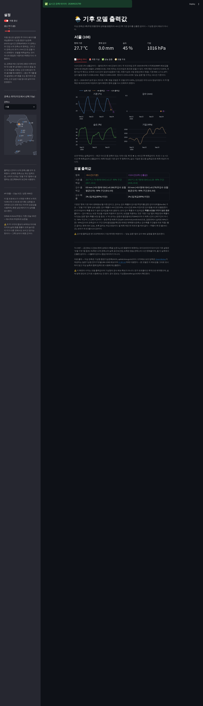
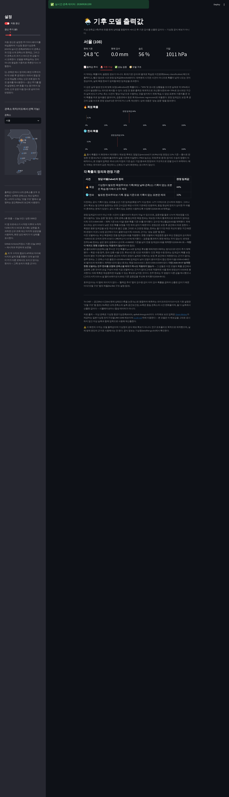
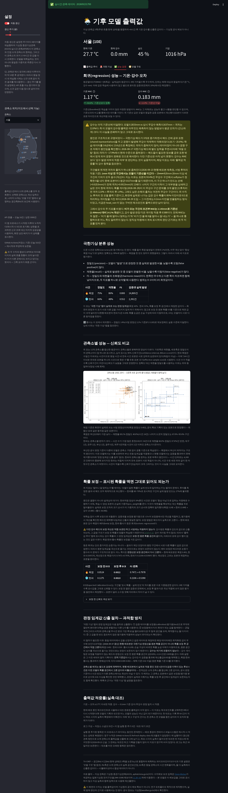
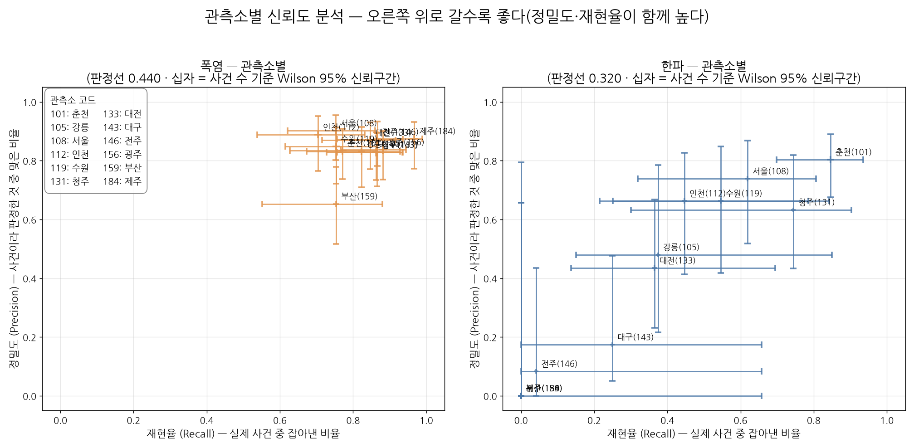
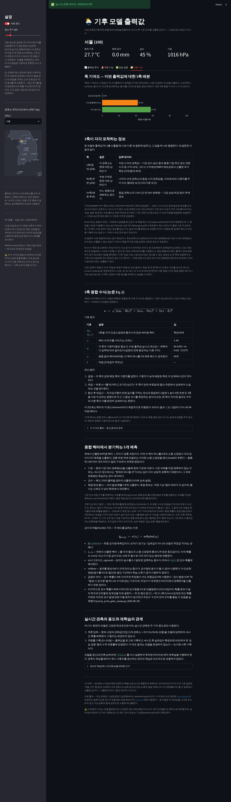
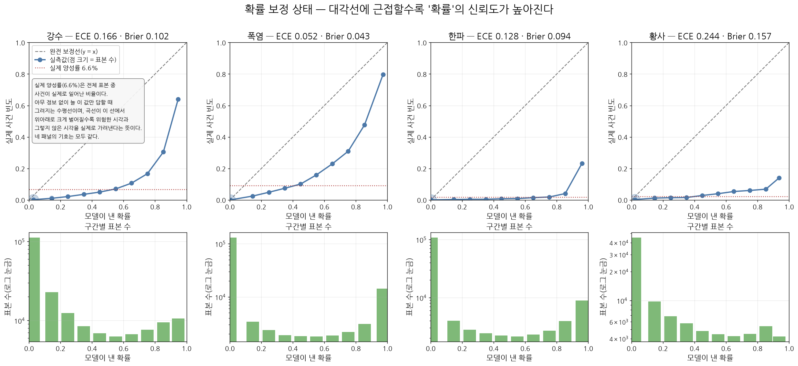
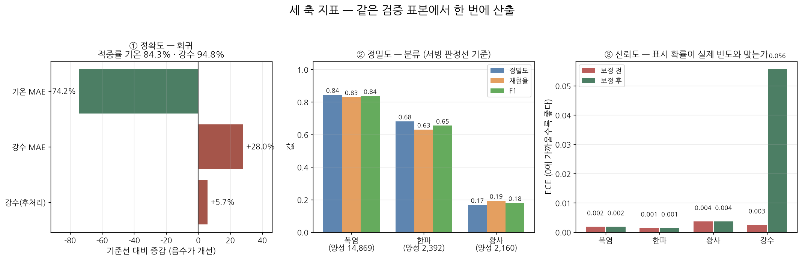
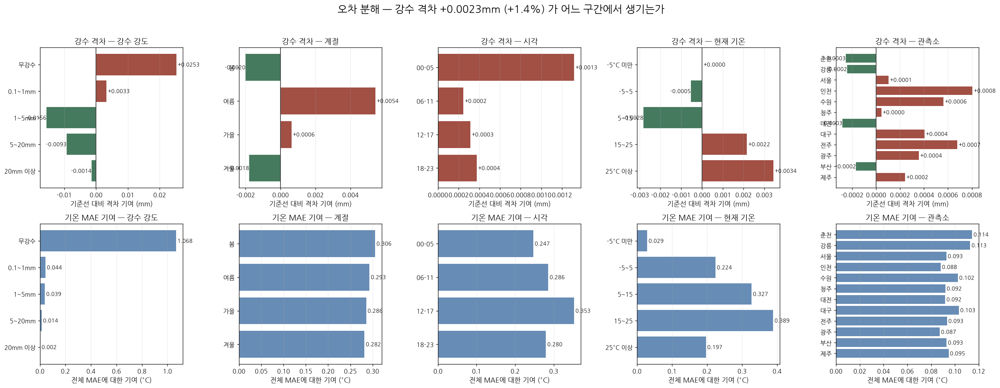
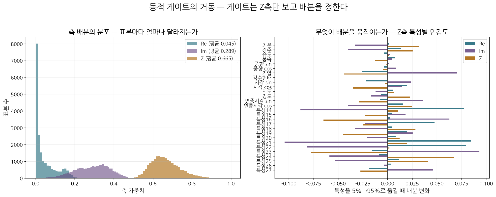

# 환경 예보 (climate-forecast)

기상청 종관기상관측(ASOS) 지상 관측 자료를 이용해 6시간 후 기온·강수·극한기상 확률을 산출하는 3축 멀티모달(multimodal) 파이프라인이다.

논문 Tri-CHEF(*Complex-Hermitian Embedding Fusion for Korean Multimodal Retrieval*, Zenodo 프리프린트, DOI [10.5281/zenodo.20034370](https://doi.org/10.5281/zenodo.20034370))의 3축 융합 수식만을 차용하여, 원 논문의 대상 과제인 한국어 멀티모달 검색과는 상이한 기후 예측 과제에 적용한 실험이다. 이 과정에서 발견한 문제와 그 해결 과정을 코드 및 실험 결과로 기록한다.

> ⚠️ 본 저장소의 산출값은 모델 출력값이며, 기상청의 공식 예보·특보가 아니다.
> 기상산업진흥법상 예보업은 등록이 필요한 사업이므로, 실제 방재 판단의 근거로 사용해서는 안 된다.

### 요약(Summary) — 그룹 분할(group split) 검증 기준, 2026-08-17

| 항목 | 값 | 평가 |
|---|---|---|
| 기온 평균절대오차(MAE) | 1.30°C | 퍼시스턴스(persistence) 대비 **+61.2%** |
| 강수 MAE | 0.167mm | 상시 무강수 예측 대비 **9.9% 미달**(기준선 미도달) |
| 폭염 F1 / 한파 F1 | 0.814 / 0.458 | 한파는 헤드 디커플링 적용값 — 아래 참조 |
| 계절 오탐(seasonal false alarm) | 최악 0.06% | 이전 배포본은 85.7% — 아래 참조 |

근거와 조건, 한계는 [결과 요약](#결과-요약)을 참조한다.

## 대시보드(Dashboard)

▶ **[climate-forecast.streamlit.app](https://climate-forecast-bpvbmtrt3zj4l8fjtcipad.streamlit.app/)**

12개 관측소 중 하나를 선택하여 실시간 관측값, 6시간 후 출력값, 극한기상 확률, 성능 지표, 모델 내부 구조를 확인할 수 있다.

> **접속 시 화면이 표시되지 않는 경우** — Streamlit Community Cloud는 일정 시간 접속이 없으면 앱을 절전 상태로 전환한다.
> "This app has gone to sleep" 화면이 나타나면 재시작 버튼을 누르고 1~2분 대기한다.
> 아래 스크린샷으로 화면 구성을 먼저 확인할 수 있다.

### 출력값 추이

선과 막대는 최근 72시간의 실측값이며, ★ 표시가 이번 6시간 후 출력값이다. 예측 대상은 기온·강수 두 항목이며, 습도·기압은 상황 판단을 위한 참고용 실측값으로 예측 대상이 아니다.



### 극한기상(Extreme Weather)

폭염·한파·황사 확률과 판정 임계값(threshold, 빨간 점선)을 함께 표시한다. 각 확률이 어떤 정답 라벨(label)로 학습되었는지, 그 라벨의 한계는 무엇인지를 화면에 명시한다.



### 성능 검증

회귀 MAE는 기준선(baseline, 학습을 거치지 않은 자명한 방법) 대비 개선율과 함께 표시한다. MAE는 절대값만으로는 성능의 좋고 나쁨을 판단할 수 없으며, 기준선과의 비교를 통해서만 의미를 가진다.

- 기온 1.30°C — 퍼시스턴스(T(t+6)≈T(t)) 대비 **+61.2% 개선**.
- 강수 0.167mm — 상시 무강수 예측 대비 **9.9% 미달**. 기준선에 미치지 못하는 지표도 은폐하지 않고 그대로 제시한다.

> 2026-08-16 검증 방식을 변경했다. 이전 버전(기온 1.26°C·강수 0.9% 미달)보다 위 수치가 낮아 보이나, 모델 성능이 저하된 것이 아니라 검증 방식의 결함이 제거된 결과다. 상세 내용은 [정직한 한계 9번](#9-검증-분할이-일-단위-라벨을-누수시키고-있었다)을 참조한다.
> 같은 날, 연중 주기 특징(day-of-year feature)을 추가한 재학습(이하 A안)도 시도했다. 한파 헤드(head)가 기온에 반대로 반응하는 오류가 발견되어 원상복구했다. seed를 바꿔 4회 재학습한 결과 2회에서 같은 역전이 재현되었고, 집계 지표(F1·MAE)는 이 결함을 전혀 탐지하지 못했다 — "시도했다가 원복한 시험" 항목을 참조한다.

극한기상 평가에는 정확도(accuracy) 대신 정밀도(precision)·재현율(recall)·F1을 사용한다. 폭염 발생일이 전체의 1%에 불과한 경우, 항상 "폭염 아님"으로 답해도 정확도는 99%에 달하기 때문이다.



### 관측소별 신뢰도 분석 — 재현율×정밀도 캘리브레이션(Calibration)

위 표는 12개 관측소를 합산한 평균값이다. 한파 헤드의 오류를 수정하는 과정에서 "평균이 정상이어도 특정 관측소만 유의하게 낮을 수 있다"는 의문이 제기되어, 관측소별로 분해하여 검토했다.

방법은 다음과 같다. 관측소당 점 하나를 배치하며, x축은 재현율, y축은 정밀도다. 정확도 대신 이 두 지표를 사용하는 이유는 위와 동일하다 — 한파·황사처럼 양성(positive) 사례가 드문 사건은 accuracy로 평가하면 항상 높게 나와 변별력이 없다. 점에 부착된 십자 표시는 95% 신뢰구간(confidence interval, Wilson score)이다. 초기에는 시간 단위 표본을 독립 시행(independent trial)으로 가정해 계산했으나, 한파·폭염은 수일간 지속되는 사건이므로 동일 사건 내 연속된 시간 표본은 서로 독립이 아니다. 이를 무시하면 신뢰구간이 실제보다 좁게, 즉 과신(overconfidence)하게 산출된다. 따라서 "24시간 이내로 연속된 표본을 하나의 사건으로 묶은 수"를 유효 표본 크기(effective sample size)로 사용해 재계산했다(점 추정값인 재현율·정밀도 자체는 시간 단위를 그대로 사용한다 — 다른 표의 F1과 정의를 일치시키기 위함이다).



**그림 읽는 법.** 왼쪽이 폭염, 오른쪽이 한파이며 점 하나가 관측소 하나다. 가로축은 재현율(실제 사건 중 잡아낸 비율), 세로축은 정밀도(사건이라 판정한 것 중 맞은 비율)이므로 **오른쪽 위로 갈수록 좋다**. 두 축이 상충한다는 점이 핵심이다 — 판정 임계값을 낮추면 재현율이 오르는 대신 정밀도가 떨어져 점이 왼쪽 위에서 오른쪽 아래로 이동한다. 어느 한쪽만 보면 임계값을 조작해 얼마든지 좋아 보이게 만들 수 있으므로 두 축을 동시에 본다. 점에 붙은 십자는 Wilson 95% 신뢰구간이며, **길이가 곧 표본 부족의 크기**다 — 한파 오른쪽 그림에서 십자가 화면 폭의 절반에 이르는 관측소들은 사건이 10건 내외뿐이라 점의 위치를 신뢰할 수 없다는 뜻이다. 왼쪽 위 상자는 관측소 코드와 이름의 대응표다.

실측 결과 두 가지 이상 패턴이 발견되었으며, 두 원인 모두 규명했다(`station_anomaly_investigate.py`).

- **폭염: 부산만 유의하게 낮다 — 판정 기준 자체가 상이하다.** 나머지 11개 관측소는 재현율 82~91%, 정밀도 74~85%로 군집을 이루나, 부산(관측소 코드 159)만 재현율 71%, 정밀도 47%로 이탈한다. 원인 분석을 위해 오탐(모델이 폭염으로 예측했으나 공식 미판정)일 때의 기온을 확인한 결과, 부산은 오탐 시 평균 기온이 28.65°C로 부산 자신의 실제 폭염일 평균(27.38°C)보다 오히려 높았다. 대구는 반대로 오탐 시 기온(27.46°C)이 실제 폭염일 평균(28.58°C)보다 낮다 — 대구는 판정 경계 부근에서 혼동이 발생하는 통상적 패턴이며, 부산은 최고 기온일조차 공식적으로 폭염 미판정될 만큼 판정 기준 자체가 다르다. 모델은 관측소 구분 없이 공통 기준으로 학습되었으므로, 부산에서만 체계적으로 낮은 성능을 보인다.

  당시에는 재학습 없이 부산 전용 임계값(0.33)을 산출해 적용했다(순이득 +0.039). 그러나 2026-08-17 극한기상 헤드에 부호 표현을 추가한 이후 재검증하니, 부산 전용값의 순이득이 **−0.0033**으로 오히려 전역 0.5보다 나빴다(부산 정밀도도 47%에서 54.0%로 개선되었다). 검증을 통과하지 못한 예외는 두지 않는다는 규약에 따라 예외를 제거했으며, 현재 `STATION_EVENT_THRESH_OVERRIDES`는 비어 있다. 부산이 여전히 가장 낮은 관측소라는 사실 자체는 변하지 않았다 — 공식 판정 기준이 다른데 모델이 관측소 구분 없이 학습된다는 구조가 그대로이기 때문이다.
- **한파: 대구·강릉도 결국 표본 부족이 원인이었다 — 시간 수는 착시였다.** 시간 단위 표본만 보면 대구 288건, 강릉 216건으로 남부·해안 관측소(24~192건)보다 많아 보였다. 그러나 24시간 이내 연속 표본을 하나의 사건으로 묶어 세면 대구 10건, 강릉 8건에 불과했다(춘천은 동일 기준으로 40건). 사건 수와 예측확률·미탐지율(miss rate)이 거의 정확히 함께 변화했다(대구: 사건 10건, 평균확률 0.275, 미탐지율 73%; 춘천: 사건 40건, 평균확률 0.658, 미탐지율 32%) — 별도의 원인이 아니라 표본 부족이 원인이었음을 확인했다.

이 플롯은 `calibration_plot_diagnose.py`로 재생성하며, 체크포인트를 승격하면 `promote_checkpoint.py`가 자동으로 다시 그린다. 승격 절차를 거치지 않고 체크포인트만 바꾼 경우에는 직접 실행해야 한다 — 그림이 이전 모델 시점에 머무는 사고가 실제로 있었다(규약으로 고정한 경위는 [체크포인트 승격 자동화](#자동화-가능-범위--부분-자동화가-현실적이다) 참조).

### 모델 구조

출력마다 재계산되는 축별 기여도, 3축 각각의 정의, 융합 수식 기호의 의미, 원 논문과의 관계를 화면에서 확인할 수 있다.



## API 사용 시 유의사항

본 저장소를 직접 실행하려면 기상청 API 허브(apihub.kma.go.kr) 인증키가 필요하다. 아래 제약사항을 먼저 확인한다.

### 1. 호출량 — 산출값 1건당 API 15회 호출

| 구성 | 호출 수 |
|---|---|
| 대상 관측소 현재 관측 | 1 |
| 인접 11개 관측소(Re축 공간 보간장) | 11 |
| 대상 관측소의 1·3·6시간 전 관측(Im축 경향 벡터) | 3 |
| **합계** | **15** |

이 비용은 접속자 수와 화면 갱신 횟수의 곱으로 증가한다. 대시보드 기본 갱신 주기가 5분이므로, 캐시가 없으면 관측소 1개만 열람해도 일일 4,320회에 도달한다.

### 2. 차단 이력 — 누적 약 9,800건

대량 수집 시도 시 누적 약 9,800건에서 차단되었다(2026-08-07 확인, 동시성 16 조건). 병렬화로 우회할 수 없는, 요청 수 자체를 기준으로 하는 제한으로 판단된다. 따라서 과거 데이터를 API로 수집하는 시도는 하지 않는다 — 기상자료개방포털의 파일셋(CSV 일괄 다운로드)을 사용한다.

### 3. 본 저장소의 대응

| 장치 | 내용 |
|---|---|
| **관측 시각 단위 캐시** | 출력값을 (관측소, 관측 시각) 키로 캐시한다. ASOS는 매시 정각에 1회 관측하므로, 동일 정시 내 재조회는 동일한 값을 반환한다. 이에 따라 호출량이 갱신 주기·접속자 수와 무관하게 관측소당 시간당 15회로 고정된다 |
| **일일 상한** | `KMA_DAILY_CALL_BUDGET`(기본값 3,000). 초과 시 예외 대신 폴백(fallback)으로 전환하며, 화면 상단에 해당 상태를 표시한다 |
| **사용량 표시** | 사이드바에 당일 누적 호출 수를 실측값으로 표시한다 |
| **폴백 데이터 격리** | `SUCCESS_LIVE` 응답만 모델 입력으로 사용한다. 폴백 레코드를 그대로 사용하면 합성 기본값이 실측값으로 위장되어 보간장에 반영되기 때문이다 |

동일 정시 2회 실행 시 호출 증가는 0건으로 확인되었다. 실사용 기준으로는 대시보드 360~720회에 자동 갱신 288회를 더해 일일 약 650~1,000회이며, 이는 차단 지점의 7~10% 수준이다.

### 4. 인증키 관리

인증키는 용도별로 분리하여 관리하며, 저장소에는 포함하지 않는다.

| 실행 환경 | 저장 위치 |
|---|---|
| 로컬 실행 | `.env`(gitignore 대상) |
| Streamlit Cloud 배포 | 앱 설정의 Secrets |
| GitHub Actions 자동 갱신 | 저장소 Secrets |

```toml
# Streamlit Secrets 형식 — 값은 반드시 큰따옴표로 감싼다.
KMA_API_KEY = "발급받은_키"
KMA_STN = "108"
```

> 따옴표를 생략하면 TOML 파싱이 실패하여 앱이 인증키를 읽지 못한다.
> 이 경우 화면은 대체값으로 정상적으로 표시되어 식별이 어렵다 —
> 사이드바의 API 호출 수가 0이면 이 상황을 의심한다.

## 결과 요약

**학습 데이터**: 2013-01-01~2026-08-10(약 13.6년), 12개 관측소(서울·인천·수원·춘천·강릉·대전·청주·전주·광주·대구·부산·제주) 통합, ASOS 시간자료 1,382,583건 → (t, t+6h) 유효 쌍 1,380,966개.

### 검증 방식 재정립(2026-08-16)

학습·검증 분할을 시각 단위 무작위 분할에서 날짜 단위 그룹 분할로 변경했다. 폭염·한파·황사 라벨은 (관측소, 날짜) 단위로 부여된다 — 특보가 발효된 날은 해당 일의 24개 시각 표본 전체가 동일한 라벨을 받는다. 그러나 기존 분할은 시각 단위 무작위였다. 확인 결과 판정 가능한 검증 표본의 100.00%가 학습셋과 동일 날짜 짝을 보유했다(양성 표본만 산정해도 100.00%). 모델이 해당 관측소·날짜의 정답을 학습 과정에서 이미 확인한 상태로 평가받고 있었다는 의미다. 날짜 전체를 한쪽에 배정하는 그룹 분할로 전환하자 극한기상 F1이 대폭 하락했다 — 모델 성능 저하가 아니라 부풀려진 값이 정상화된 결과다. 상세 경위와 수치는 [정직한 한계 9번](#9-검증-분할이-일-단위-라벨을-누수시키고-있었다)을 참조한다.

이하 결과는 모두 그룹 분할 방식으로 측정했다. 별도 보존한 v3~v7 및 3축 적용 효과 표는 무작위 분할로 측정한 이전 세대 기록이며, 비교 목적이 아니라 이력 보존 목적으로 유지한다.

### 13년 데이터 재학습 결과(그룹 분할 검증, 표본 276,116개)

| 지표 | 모델 | 기준선(학습 없는 자명한 방법) | 평가 |
|---|---|---|---|
| 기온 MAE | **1.2966°C** | 퍼시스턴스 T(t+6)≈T(t): 3.3452°C | **−61.2%**(개선) |
| 강수 MAE | 0.1665mm | 상시 무강수 예측: 0.1515mm | **9.9% 미달** |

강수는 여전히 기준선에 미달하나 격차가 −17.9%에서 −9.9%로 좁혀졌다. 본 저장소에서 기록한 가장 좋은 강수 성능이다. 극한기상 헤드에 부호 표현을 추가하면서(아래 '계절 오탐' 참조) 헤드들이 공유 표현(shared representation)을 두고 벌이던 경쟁이 완화된 것으로 해석한다 — 극한기상 헤드가 필요한 정보를 별도 입력에서 얻게 되어 공유 표현을 왜곡할 유인이 줄었다. 다만 이는 실측된 상관이며 인과를 분리 검증하지는 않았다.

동적 게이팅(dynamic gating)이 학습한 축 배분은 검증셋 평균으로 공간보간장(Re) **48.4%**, 시간경향벡터(Im) **20.8%**, 수치 센서(Z) **30.7%**다(`gate_behavior_check.py`, 검증셋에서 무작위 추출한 20,000 표본).

> 이 값의 출처를 명시한다. 체크포인트의 `diagnostics` 필드에도 축 배분이 들어 있으나(Re 0.629 · Im 0.196 · Z 0.175), 그것은 학습 중 **마지막 배치 하나**에서 수집한 값이라 데이터셋 평균이 아니다. 이전 판이 인용하던 41.3/22.5/36.2는 이전 세대 체크포인트의 값으로, 현행 모델에는 해당하지 않아 정정했다(2026-08-17). 배분은 표본마다 달라지므로(Re 표준편차 0.090, 범위 0.21~0.87) 어떤 표본에서 잰 평균인지를 함께 적어야 한다.

<a id="a-plan-rollback"></a>

### 시도했다가 원복한 시험 — 연중 주기 특징 추가(A안, 2026-08-16)

`partition_heterogeneity.py`로 분할 후보 축을 검토한 결과, 관측소(η²=0.00%)는 분할 근거가 없었으나 월(계절)은 입력 어디에도 포함되지 않은 상태였다. 시각 정보를 이미 아는 상태에서도 월 정보를 추가하면 기온 변화량(ΔT) 설명력이 6배 이상(+2.59%p) 증가했다. 이를 근거로 수치 입력에 연중 시각 sin/cos(day-of-year, 12→14차원)를 추가해 재학습한 결과 기온 MAE가 1.3551→1.2987°C로 개선되었다.

그러나 한파 헤드가 기온에 반대 방향으로 반응하는 오류가 발견되어 원상복구했다. 서울을 기준으로 다른 조건을 고정하고 기온만 15°C에서 33°C로 상승시키자, 한파 확률이 0.14에서 0.97로 상승했다(`coldwave_sensitivity_check.py`로 확인). 습도를 상승시켜도 한파 확률이 함께 상승했다 — 두 경우 모두 물리적으로는 반대 방향이 정상이다. 체크포인트 4종을 비교한 결과, A안 재학습 직후(헤드 디커플링(decoupling) 적용 이전)부터 이미 이 역전 현상이 존재했다. 원인은 한파 헤드 디커플링이 아니라 A안 재학습 자체다.

#### 재현성 검증 — seed 4회 실험

이 역전이 A안의 구조적 결함인지, 한 번의 불운한 학습이었는지 가리기 위해 데이터 분할은 고정한 채 초기화·학습 확률성만 바꿔(`INIT_SEED`) 4회를 재학습했다. 나머지 조건(그룹 분할, 배치 1024, 학습률 1e-3)은 4회 모두 동일하다. **판정 규칙은 결과를 확인하기 전에 고정했다** — 역전이 1회뿐이면 승격 후보로 인정하고, 2회 이상이면 근본 원인 규명 전까지 보류한다.

| seed | 단조성 판정 | 기온 MAE | 강수(기준선 대비) | 폭염 F1 | 한파 F1 |
|---|---|---|---|---|---|
| 42 | **역전**(여름 +0.385 · 가을 +0.187) | 1.2987°C | −17.8% | 0.808 | **0.490** |
| 7 | 통과 | 1.2967°C | −15.1% | 0.812 | 0.438 |
| 13 | 통과 | 1.3020°C | −14.0% | 0.801 | 0.446 |
| 2026 | **역전**(여름 +0.382 · 가을 +0.460) | **1.2949°C** | −17.1% | 0.811 | 0.426 |
| *v9(12차원, 당시 배포본)* | *통과* | *1.3551°C* | *−17.9%* | *0.813* | *0.465* |

**4회 중 2회에서 역전이 재현되었다.** 한 번의 불운이 아니라 A안의 학습 자체가 불안정하다는 의미이며, 사전에 고정한 규칙에 따라 A안을 보류한다.

**집계 지표는 이 결함을 전혀 탐지하지 못한다.** 이것이 본 실험의 가장 중요한 결과다. 역전된 seed 42는 네 실행 중 한파 F1이 가장 높고(0.490), 배포 중인 v9(0.465)보다도 높다. 역전된 seed 2026은 기온 MAE가 가장 좋다(1.2949°C). 즉 F1·MAE만 기준으로 최선을 고르면 **물리적으로 가장 깨진 모델을 선택하게 된다.** 두 역전 체크포인트의 한파 F1(0.490 · 0.426)은 통과한 두 개(0.438 · 0.446)와 겹치는 범위에 있어, 지표 분포만으로는 구분 자체가 불가능하다.

역전의 형태는 계절에 국한된다. 겨울 구간에서는 정상으로 보이고 여름·가을의 고온부에서만 확률이 치솟는다 — seed 2026은 10월 30°C에서 한파 확률 0.90, 1월에는 기온과 무관하게 0.62~0.77로 사실상 무반응이었다. 근본 원인은 규명하지 못했다. 연중 시각 특징이 계절 신호를 제공하면서 한파 헤드가 기온 경로 대신 계절 경로에 의존하게 되고, 그 결합이 학습 초기값에 따라 불안정하게 형성되는 것을 유력한 가설로 본다.

**후속(2026-08-17) — 근본 원인은 계절이 아니라 부호였다.** 위 가설(계절 지름길)을 검증하려고 계절과 기온이 각각 확률을 얼마나 움직이는지 정량화했으나(`coldwave_pathway_check.py`), 계절 의존도가 역전본과 정상본에서 범위가 겹쳐 가설이 뒷받침되지 않았다. 같은 진단을 폭염 헤드로 확장하다가 훨씬 심각한 결함을 발견했고 — 융합 수식이 부호를 없애 한겨울에 폭염 확률이 올라갔다 — 그 해결책(극한기상 헤드에 부호 표현 추가)이 한파 역전까지 함께 해소했다. 상세 내용은 [계절 오탐](#seasonal-false-alarm)을 참조한다. A안의 연중 시각 특징은 이 구성의 일부로 현재 배포에 포함되어 있다.

### 극한기상 분류 성능(그룹 분할 검증, 판정 임계값 0.5 기준)

| 사건 | 정밀도 | 재현율 | F1 | 검증셋 양성 표본 |
|---|---|---|---|---|
| 폭염 | 77.8% | 85.3% | 0.814 | 15,525건 |
| 한파 | 43.4% | 48.4% | 0.458 | 3,864건 |

<a id="coldwave-decouple"></a>

**한파 헤드 디커플링 재적용(2026-08-17).** 부호 표현을 넣은 승격 시점에는 한파 F1이 0.449였다. 직전 세대는 한파 헤드만 디커플링(decoupling — 트렁크 동결, 헤드만 미세조정)해 0.465를 기록했으나, 헤드를 미세조정하면 단조성을 다시 검증해야 해서 당시에는 제외했다. 그 검증이 승격 게이트(`promote_checkpoint.py`)로 자동화된 뒤 다시 적용해 **0.449 → 0.458**이 되었다. 트렁크를 얼렸으므로 기온 MAE(1.2966°C)·강수 MAE(0.1665mm)·폭염 F1(0.814)은 소수점 넷째 자리까지 변하지 않았고, 게이트 4종(계절 오탐 0.06%, 단조성 한파 −0.594·폭염 +0.558, 관측소 라벨 사각지대, 회귀 성능)을 모두 통과했다.

이 과정에서 미세조정 스크립트의 결함을 하나 발견했다. `head_decouple_finetune.py`가 최선 에폭의 가중치를 `state_dict()`로 담아두었는데, 이 함수는 파라미터 텐서를 복사하지 않고 그대로 돌려주므로 이후 에폭의 갱신이 그 텐서를 제자리에서 덮어썼다 — 즉 "최선 에폭을 저장한다"고 출력하면서 실제로는 항상 마지막 에폭을 저장하고 있었다. 최선 에폭으로 보고한 0.462와 저장본을 재계산한 0.458이 어긋나 드러났다(`patch_extreme_metrics.py`). `detach().clone()`으로 수정했다. 다만 재실행해 0.462를 취하지는 않았다 — 그 값은 보고에 쓰는 바로 그 검증셋에서 30개 에폭 중 최댓값을 고른 것이라 선택 편향이 섞인다. 30개 에폭이 모두 0.454~0.462로 이전 값 0.449를 넘으므로 이득 자체는 견고하며, 편향이 없는 마지막 에폭 값(0.458)을 채택했다.

임계값은 검증셋 절반(보정용)에서 산출하고 나머지 절반(평가용)에서 검증하는 절차를 따른다. 강수만 재산출값(t=0.83, 순이득 +0.101)을 채택했다. 폭염·한파·황사는 순이득이 각각 +0.004·+0.004·+0.002로 채택 기준(0.01)에 미달하여 기본값 0.5를 유지한다. 이 값들은 확률 보정 전(원본) 공간의 값이며, 화면 판정에 실제로 쓰이는 값은 [확률 보정](#prob-calibration)에서 따로 정한다.

황사는 본 표와 대시보드에서 제외했다. 정밀도가 11.8%에 불과해 황사로 판정한 결과 중 88.2%가 오탐이다(재현율 50.4%, F1 0.191). PM10 농도는 국외 장거리 수송의 영향이 지배적이나 본 모델의 입력은 국내 12개 지점의 기상 관측값에 한정되어, 구조적으로 판별 단서가 부족한 것으로 판단된다.

제외 근거는 정밀도만이 아니다. **12개 관측소 중 6곳(강릉·인천·청주·대전·부산·제주)은 황사 라벨이 아예 없다** — PM10 관측망이 절반에만 있기 때문이다. 이 관측소들의 황사 출력은 학습에서도 평가에서도 한 번도 채점된 적이 없는데, 실제로는 임계값을 넘는 비율이 2~23%에 달한다(인천 23.4%). 화면에 표시했다면 검증된 적 없는 경보가 나갔을 것이다. 이 사각지대는 `station_coverage_check.py`로 상시 점검한다 — 폭염·한파는 12개 관측소 전부 라벨을 보유해 같은 문제가 없음을 확인했다.

헤드 자체는 유지되어 계산은 계속되나 화면에는 표시하지 않는다.

이전 세대(3.6년 데이터, 무작위 분할) 축 구성별 비교 및 Phase 3-6 경보 게이트 지표는 [부록 — 이전 세대 기록](#부록--이전-세대-기록)으로 이전했다.

<a id="seasonal-false-alarm"></a>

### 계절 오탐 — 융합 수식이 부호를 없앤다(2026-08-17)

본 저장소에서 발견한 가장 심각한 결함이며, 집계 지표로는 **구조적으로 탐지되지 않았다.**

이전 배포본(12차원)의 폭염 헤드가 한겨울에 작동했다. 합성 입력이 아니라 그 시각의 실제 이웃 관측(Re축)·실제 경향(Im축)을 그대로 사용한 실측이다.

| 실제 기온대 | 표본 | 폭염 확률 평균 | 0.5 초과 비율 |
|---|---|---|---|
| −15°C 이하 | 809건 | 0.73 | **85.7%** |
| −15~−10°C | 6,515건 | 0.54 | 57.4% |
| 30°C 이상(정상 동작) | 54,275건 | 0.80 | 85.7% |

**원인은 융합 수식이다.** `s = √((w·v)²)`는 제곱을 거치며 부호를 없애므로, 모든 헤드는 `|편차|`만 볼 뿐 위로 벗어났는지 아래로 벗어났는지 알 수 없다. 극단적 저온의 큰 편차가 극단적 고온과 같은 크기로 들어온다. 회귀 기온 헤드가 퍼시스턴스 잔차 구조를 쓰는 이유와 정확히 같은 문제이며(위 '아키텍처' 참조), 분류 헤드에서도 같은 원인이 작동한다는 것을 오랫동안 인지하지 못했다.

**F1 0.813에 잡히지 않은 이유**: 폭염 라벨은 공식 특보 기록이 있는 표본에서만 채점한다. 겨울 표본은 마스크가 0이므로 **애초에 채점 대상이 아니다.** 지표가 구조적으로 눈감고 있던 구간이며, 이를 드러내려면 라벨과 무관하게 기온대별로 확률을 직접 보는 수밖에 없었다(`seasonal_falsealarm_check.py`).

**해결**: 극한기상 헤드 3종의 입력을 `s` 단독에서 `[s, v_Z]`로 확장했다. `v_Z`(정규화된 Z축 임베딩)는 제곱을 거치지 않아 부호가 살아 있다. 원본 수치 벡터를 직접 넣지 않은 이유는 거기에 위도·경도가 포함되어 헤드가 관측소를 암기할 통로가 되기 때문이다(Phase 3-6 PPO에서 실제로 발생한 문제). 회귀·강수 헤드는 변경하지 않았다.

| 체크포인트 | 겨울 폭염 오탐 | 여름 한파 오탐 | 최악값 |
|---|---|---|---|
| 이전 배포본(12차원) | 85.7% | 0.84% | **85.7%** |
| 연중 시각만 추가(14차원) | 0.00% | 11.8% | **11.8%** |
| 14차원 + 부호 표현 | 0.00% | 0.04% | **0.08%** |
| **현행(＋한파 헤드 디커플링)** | **0.00%** | **0.01%** | **0.06%** |

연중 시각 특징만 추가해도 겨울 폭염은 해소되나 여름 한파 오탐이 남았다. 두 극단을 모두 잡은 것은 부호 표현을 넣은 이후다. 한파 헤드 디커플링([위 항목](#coldwave-decouple))은 오탐을 더 낮추면서 F1을 올렸다.

부수적으로 관측소별 예외 임계값이 불필요해졌다. 이전 배포본에서는 부산 폭염만 정밀도가 낮아(47%) 전용 임계값 0.33을 적용했으나, 현행 모델에서 재검증하니 부산 전용값의 순이득이 **−0.0033**으로 오히려 전역 0.5보다 나빴다(부산 F1 0.574). 검증을 통과하지 못한 예외는 두지 않는다는 규약에 따라 제거했다.

### 기각한 시험 — 강수 헤드 부호 표현 · 헤드 드롭아웃(2026-08-17)

극한기상 헤드에 부호 표현을 준 조치가 강수까지 개선한 것을 근거로, 두 가지 후속 변경을 각각 독립적으로 시험했다. 한 번에 함께 넣으면 결과가 나빠졌을 때 원인을 가릴 수 없으므로 조건을 하나씩만 바꿨다. 나머지 조건(seed 7, 그룹 분할, 배치 1024, 학습률 1e-3)은 현행과 동일하다.

아래 표의 기준선은 **시험 당시 배포본**(부호 표현 적용, 디커플링 전)이다. 세 시험 모두 이 기준선에서 조건 하나씩만 바꿔 재학습했으므로, 이후 승격한 디커플링 결과와 섞지 않는다.

| 지표 | 시험 당시 배포본 | A: 강수 헤드 부호 표현 | B: 헤드 드롭아웃 0.1 | C: 한파 헤드 전용 드롭아웃 0.1 |
|---|---|---|---|---|
| 기온 MAE | **1.2966°C** | 1.4104°C | 1.3120°C | 1.3053°C |
| 강수(기준선 대비) | **−9.9%** | −20.7% | −12.7% | −19.8% |
| 폭염 F1 | **0.814** | 0.801 | 0.809 | 0.802 |
| 한파 F1 | 0.449 | 0.415 | 0.472 | **0.460** |
| 계절 오탐 최악값 | **0.08%** | — | 38.8%(FAIL) | **0.70%(PASS)** |

**A — 가설이 기각되었다.** 강수 헤드가 공유 표현 경쟁에서 벗어나면 강수가 더 좋아질 것으로 예상했으나, 개선하려던 강수가 가장 크게 악화되었다(−9.9% → −20.7%). 극한기상 헤드에서 통했던 조치가 강수 경로에는 통하지 않는다. 강수량은 부호가 있는 양이 아니므로(항상 0 이상), 극한기상에서 부호 표현이 해결했던 문제 자체가 강수에는 존재하지 않았던 것으로 해석한다.

**B — 지표만 보면 채택할 뻔했다.** 한파 F1이 0.472로 디커플링 없이 기록한 최고값이었다. 드롭아웃이 정규화로 작용해 사건이 8~40건뿐인 희소 헤드의 과적합을 억제한 것으로 보인다. 그러나 승격 게이트에서 **계절 오탐 38.8%로 FAIL**했다 — 겨울 폭염 오탐이 되살아났다(−15°C 이하 809건 중 38.8%가 판정선 초과).

원인은 드롭아웃이 무엇을 끄는지 생각하면 분명하다. 겨울 폭염 오탐을 해결한 것은 헤드에 부호 표현(`v_Z`)을 넣은 조치인데, 헤드 드롭아웃은 그 경로의 유닛을 무작위로 끈다. **결함을 고친 바로 그 경로를 학습 중에 반복적으로 차단한 셈**이다. 두 변경은 함께 쓸 수 없다.

이 사례는 승격 게이트를 만든 이유를 그대로 보여준다 — F1·MAE만 보았다면 한파 개선을 근거로 채택을 검토했을 것이고, 겨울이 되어서야 결함을 발견했을 것이다.

**C — 격리는 성공했으나 강수에서 예상 밖 부작용이 나왔다.** B에서 드러난 원인 분석에 따라 드롭아웃을 한파 헤드에만 적용해(`COLDWAVE_DROPOUT=0.1`, 폭염·황사 헤드는 미적용) 폭염의 부호 경로를 건드리지 않도록 격리했다. 의도한 효과는 그대로 나왔다 — 계절 오탐 0.70%로 승격 게이트 통과, 단조성도 두 헤드 모두 개선되었고, 한파 F1도 0.460으로 디커플링 없이 기록한 두 번째로 높은 값이다. 그러나 강수가 −19.8%로 B(−12.7%)보다도 나빠졌다. 헤드별 입력을 분리해도 트렁크와 게이트는 여전히 공유되므로, 한 헤드만 드롭아웃을 걸어도 그 경사(gradient)가 공유 표현을 거쳐 강수 경로까지 흔든 것으로 추정한다. 한파 F1 개선(+0.011)이 강수 악화(약 10%p)를 정당화하지 못한다고 판단해 **채택하지 않는다**. 코드는 `COLDWAVE_DROPOUT` 환경변수로 재현 가능하게 남기되 기본값은 0(끔)이다. 헤드 드롭아웃 계열(B, C)은 이것으로 결론 내리며, 같은 방향의 재시도는 트렁크·게이트 공유 문제를 먼저 해소하지 않는 한 근거 없이 다시 하지 않는다.

<a id="prob-calibration"></a>

### 기각한 시험 — 황사 헤드 제외(2026-08-17)

황사는 정밀도 11.8%로 실용 수준에 미달해 화면에서 이미 제외돼 있고, 12개 관측소 중 6곳은 라벨이 아예 없어 채점된 적도 없다. 한편 "헤드가 늘면 강수가 나빠진다"는 것은 이 저장소가 이미 확립한 사실이다(`EXTREME_BCE_WEIGHT`를 1.0→0.3으로 낮춰 강수를 −25.6%→−19.3%로 개선한 실측). 그렇다면 **쓰지도 않는 헤드를 손실에서 빼면 나머지가 좋아질 것**이라는 가설이 선다. 조건을 하나만 바꿔(`DUST_LOSS_WT=0`, seed 7·그룹 분할·나머지 동일) 확인했다.

| 지표 | 현행 배포 | 황사 헤드 손실 제외 | 판정 |
|---|---|---|---|
| 기온 MAE | **1.2966°C** | 1.3971°C | 악화 |
| 강수(기준선 대비) | **−9.9%** | −22.8% | **크게 악화** |
| 폭염 F1 | **0.814** | 0.777 | 악화 |
| 한파 F1 | **0.458** | 0.328 | **크게 악화** |

**가설이 정반대로 기각됐다.** 네 지표가 모두 나빠졌고, 특히 개선을 기대했던 강수가 −9.9%에서 −22.8%로 두 배 이상 벌어졌다.

기전은 게이트 배분에서 드러난다(`gate_behavior_check.py`, 두 모델을 같은 검증 표본에서 측정).

| 축 | 현행 배포 | 황사 헤드 제외 |
|---|---|---|
| Re(공간보간장) | **48.4%** | **20.4%** |
| Im(시간경향) | 20.8% | 46.0% |
| Z(수치) | 30.7% | 33.6% |

**황사 헤드가 Re축 학습을 견인하고 있었다.** 황사는 국외 장거리 수송이 지배하는 광역 현상이라 주변 지점의 공간 분포가 거의 유일한 단서이고, 실제로 Re축을 합성 위성에서 실측 IDW 보간장으로 교체했을 때 가장 크게 개선된 지표가 황사 F1이었다(0.257→0.661). 그 손실 항이 사라지자 게이트가 Re축을 버렸고(48%→20%), Re축 활용이 무너지면서 기온·강수·폭염·한파가 함께 나빠졌다.

따라서 "헤드가 늘면 강수가 나빠진다"는 서술을 정교화한다. **헤드 추가가 항상 손해인 것이 아니라, 공유 표현을 두고 경쟁하는 헤드는 손해이고 특정 축의 학습을 견인하는 헤드는 이득이다.** 황사 헤드는 후자이며, 화면에 표시하지 않더라도 **유지한다**.

<a id="prob-calibration-sec"></a>

### 확률 보정 — 표시된 확률이 실제 빈도와 일치하는가(2026-08-16)

위 지표는 "얼마나 잘 맞히는가"를 측정하나, "모델이 산출한 확률이 실제 발생 빈도와 일치하는가"는 별개의 문제다. 본 프로젝트에서 '보정(calibration)'이라는 용어는 그동안 판정 임계값 선정(`threshold_validation.py`)과 관측소별 정밀도-재현율 산점도(`calibration_plot_diagnose.py`)를 가리켰으며, 확률 자체의 정합성은 한 번도 측정한 적이 없었다. 그럼에도 대시보드는 이 확률을 막대로 그대로 노출하고 있었다.

검증셋(그룹 분할, 276,116개 표본)에서 신뢰도 곡선(reliability diagram)을 측정한 결과, 네 헤드 모두 체계적으로 과신(overconfidence)했다.



**그림 읽는 법.** 열 하나가 헤드 하나다. 윗줄은 신뢰도 곡선(reliability diagram)으로, 가로축은 모델이 낸 확률, 세로축은 그 확률을 낸 표본들에서 사건이 **실제로** 일어난 빈도다. 두 축이 같은 척도이므로 정사각형으로 그렸고, 회색 대각선(y = x)이 "말한 확률과 실제 빈도가 일치하는" 완전 보정 상태다. **곡선이 대각선 아래에 있으면 과신**(말한 것보다 덜 일어남), 위에 있으면 과소평가다. 네 헤드 모두 대각선 아래에 있었다. 점의 크기는 그 구간의 표본 수이며, 오른쪽 끝처럼 표본이 적은 구간은 빈도가 크게 요동치므로 크기를 함께 보아야 과대해석하지 않는다.

범례와 설명 상자는 첫 열(강수)에만 두었다 — 네 패널의 기호가 모두 같으므로 열마다 반복하면 곡선을 가린다.

붉은 점선은 **실제 양성률**, 즉 전체 표본에서 사건이 실제로 일어난 비율이다. 아무 정보 없이 늘 이 값만 답할 때 그려지는 수평선이므로, 곡선이 이 선에서 위아래로 크게 벌어질수록 모델이 위험한 시각과 그렇지 않은 시각을 실제로 가려내고 있다는 뜻이다. 보정은 이 변별력은 그대로 둔 채 세로 위치만 대각선 쪽으로 옮기는 작업이다.

아랫줄은 각 확률 구간의 표본 수를 로그 눈금으로 표시한다. 윗줄의 곡선이 어느 구간에서 신뢰할 만한지를 판단하는 근거이며, 네 헤드 모두 표본이 0~0.1 구간에 압도적으로 몰려 있다. ECE가 표본 수로 가중평균한 값이라 낮게 보이는 이유가 여기에 있고, 정작 화면에 노출되는 중·고확률 구간의 어긋남은 MCE로 보아야 한다.

| 사건 | 보정 전 ECE | 보정 후 ECE | 보정 전 MCE | F1 변화 |
|---|---|---|---|---|
| 폭염 | 0.0340 | **0.0048** | 0.189 | 0.8144 → 0.8144 |
| 한파 | 0.0497 | **0.0024** | 0.465 | 0.4566 → 0.4608 |
| *강수* | *0.1719* | *0.0017* | *0.573* | *0.4981 → 0.4981* |
| *황사* | *0.1196* | *0.0006* | *0.785* | *0.1889 → 0.1894* |

보정 전 열은 검증셋 전체(`probability_calibration_check.py`, 위 그림과 동일 근거)에서, 보정 후 열과 F1은 보정용/평가용을 분리한 평가용 절반(`probability_calibration_fit.py`)에서 측정했다 — 표본이 달라 소수점 셋째 자리에서 차이가 날 수 있다.

화면에 확률로 표시되는 것은 폭염·한파 두 가지다. 강수는 확률이 아니라 mm로 표시되고, 황사는 앞서 밝힌 사유로 화면에서 제외했다 — 아래 두 행은 측정 기록으로만 남긴다.

ECE(Expected Calibration Error)는 구간별 "표시 확률 − 실제 빈도"의 차이를 표본 수로 가중평균한 값이며, MCE(Maximum Calibration Error)는 그 최댓값이다. 한파의 ECE가 낮아 보이는 것은 표본 대부분이 0~0.1 구간에 몰려 있기 때문이며, 화면에 실제로 노출되는 중·고확률 구간은 MCE가 보여주듯 크게 어긋나 있었다 — 이전 배포본에서 60~70%로 표시되던 구간의 실제 발생 빈도는 27%였다. 위 표는 현행 체크포인트를 기준으로 재적합한 값이다(재학습 시마다 곡선을 다시 적합해야 한다).

**원인은 결함이 아니라 설계상의 대가다.** 한파처럼 양성이 6%뿐인 사건은 모델이 "항상 아님"으로 답하는 자명해로 붕괴하기 쉬워, 학습 시 양성 표본의 손실에 가중치(`pos_weight`)를 부여한다. 이것이 재현율을 확보하는 대신 확률을 위로 밀어올린다. 실제로 보정 오차의 크기 순서가 이 가중치의 크기 순서와 정확히 일치했다(폭염 3.06 → 한파 13.63 → 강수 15.60 → 황사 35.98).

재학습 없이 등온 회귀(isotonic regression)로 되돌렸다(`probability_calibration_fit.py`). 절차는 임계값 선정과 동일하다 — 검증셋을 보정용/평가용으로 분리하여 보정용에서만 곡선을 적합하고, 평가용에서 개선이 확인된 헤드만 채택한다.

#### 판정선은 곡선으로 옮기는 것만으로 보존되지 않는다(2026-08-17 수정)

확률을 보정했으면 판정 임계값도 보정 공간의 값이어야 한다. 처음에는 원본 임계값을 같은 곡선에 통과시켜(`event_threshold()`) 판정선으로 삼았고, 근거는 "보정은 단조 증가 변환이라 순위가 보존되므로 판정이 그대로다"였다. **이 논리는 곡선이 순증가일 때만 성립한다.** 등온 회귀의 결과는 계단 모양이라 평탄 구간을 가지며, 원본 확률이 서로 다른 표본들이 같은 보정값으로 접힌다. 임계값이 그 평탄 구간 안에 떨어지면 구간 전체가 한쪽으로 몰려 판정되어, 실효 임계값이 의도한 위치에서 벗어난다.

한파 헤드 디커플링 직후 실제로 드러났다. 임계값 0.500을 곡선으로 옮긴 0.196으로 판정하자 F1이 **0.4566 → 0.4484**로 떨어졌다 — 디커플링으로 얻은 이득(+0.009)과 같은 크기의 손실이다. 그때까지는 네 헤드 모두 보존되거나 차이가 0.0003 수준이어서 문제가 보이지 않았다.

수정은 임계값을 **판정이 실제로 이뤄지는 공간(보정 후)에서 직접 고르는** 것이다. 고르는 표본과 채점하는 표본을 분리하고, 순이득이 0.01 이상일 때만 재선정값을 채택한다(임계값 선정 규약과 동일). `calibrated_threshold_check.py`로 세 방식을 같은 평가용 표본에서 비교했다.

| 헤드 | ① 원본 공간(이상적) | ② 곡선으로 옮김(이전 방식) | ③ 보정 공간 직접 선정 | 채택 |
|---|---|---|---|---|
| 폭염 | 0.8144 | 0.8144 | 0.8142 | ② 유지(순이득 −0.0002) |
| 한파 | 0.4566 | 0.4484 | **0.4608** | **③ 채택(순이득 +0.0125)** |
| 황사 | 0.1889 | 0.1894 | 0.1909 | ② 유지(순이득 +0.0015) |

한파만 기준을 넘어 재선정값(보정 공간 t=0.224)을 채택했다. 폭염(0.389)·황사(0.084)는 옮긴 값을 그대로 쓴다. 채택된 판정선은 체크포인트에 `threshold_decision`으로 저장되어 서빙이 그대로 읽는다 — 이 키가 없는 구버전 체크포인트는 이전 방식으로 동작한다.

배포 의존성을 늘리지 않기 위해 scikit-learn을 사용하지 않는다. PAVA(pool adjacent violators)를 직접 구현하고 결과를 조회표로 저장하여, 추론 시에는 `numpy.interp`만으로 적용한다.

강수 헤드에는 보정을 적용하지 않는다. 화면에 확률이 아니라 mm로 표시되며, 강수량 = 확률 × 양(量) 구조에서 양 헤드가 보정 전 확률과 곱해지도록 함께 학습되었기 때문이다. 곡선은 분석 목적으로 체크포인트에 보존하되 서빙 경로에서는 호출하지 않는다.

<a id="metrics-and-breakdown"></a>

### 지표 분리 측정과 오차 분해(2026-08-17)

지금까지 세 지표는 서로 다른 스크립트에서, 서로 다른 분할로 나왔다. 회귀 MAE는 `train.py`, 분류 F1은 `patch_extreme_metrics.py`, 보정 오차는 `probability_calibration_check.py`가 각각 냈고 임계값 검증은 또 검증셋을 절반으로 쪼갠다. 그래서 "F1은 올랐는데 신뢰도는 어떻게 됐나"를 물으면 표본이 다른 숫자를 비교하게 된다. `eval_cache.py`가 검증셋 추론을 한 번만 수행해 캐시로 남기고, `metrics_report.py`가 그 **동일 표본 하나**에서 세 축을 모두 산출한다.



| 축 | 측정값 |
|---|---|
| 정확도(accuracy) | 기온 MAE 1.2966°C(기준선 대비 −61.2%) · 강수 MAE 0.1665mm(+9.9% 미달) · 적중률 기온 ±1.5°C 이내 67.0% · 강수 발생 여부 일치 93.3% |
| 강수 주 지표 | 발생 판정 F1 **0.427**(정밀도 45.0% · 재현율 40.7%) · 강수 구간 조건부 MAE **2.2397mm vs 기준선 2.4584mm(−8.9%)** · 무강수 구간 MAE 0.0241mm |
| 정밀도(precision) | 폭염 0.814 · 한파 0.461 · 황사 0.190 (서빙 판정선 기준) |
| 신뢰도(calibration) | ECE 폭염 0.034→0.002 · 한파 0.050→0.002 · 황사 0.120→0.000 · 강수 0.172→0.001 |

> 위 '보정 후' ECE는 검증셋 **전체**에서 잰 값이다. 보정 곡선은 이 검증셋의 절반으로 적합했으므로 그 절반이 표본에 섞여 낙관적이다. 한 번도 보지 않은 표본에서의 값은 `probability_calibration_fit.py`가 평가용 절반에서 따로 보고하며(위 표), 배포 판정의 근거는 그쪽을 쓴다.

#### 강수는 어디서 지고 있는가 — 무강수 구간이 전부다

`error_breakdown.py`로 전체 MAE를 구간별로 분해했다. 전체 MAE는 구간별 MAE의 표본 수 가중평균이므로 기여도를 `n_i/N × MAE_i`로 정확히 나눌 수 있고, 기준선도 같은 방식으로 분해하면 두 기여도의 차이가 곧 그 구간이 만든 격차다(합이 전체 격차와 일치함을 검산으로 확인했다).



| 강수 강도 | 표본 | 비중 | 모델 MAE | 기준선 | 격차 기여 | 격차 점유 |
|---|---|---|---|---|---|---|
| **무강수** | 259,101 | 93.8% | 0.0322 | 0.0000 | **+0.0302** | **201.2%** |
| 0.1~1mm | 8,361 | 3.0% | 0.4860 | 0.3731 | +0.0034 | 22.7% |
| 1~5mm | 6,374 | 2.3% | 1.9010 | 2.2669 | −0.0085 | −56.2% |
| 5~20mm | 2,081 | 0.8% | 7.6315 | 8.8578 | −0.0092 | −61.5% |
| 20mm 이상 | 199 | 0.1% | 27.9780 | 29.2884 | −0.0009 | −6.3% |

**실제로 비가 오는 구간에서는 모델이 기준선을 이긴다.** 1mm 이상 전 구간에서 격차 기여가 음수다. 지는 이유는 오직 하나 — 표본의 93.8%를 차지하는 무강수 구간에서 softplus가 정확한 0을 내지 못해 표본마다 평균 0.032mm의 오차를 깔기 때문이다. 이 구간 하나가 전체 격차의 201%를 만들고, 강수 구간의 이득이 그중 101%를 상쇄한다.

이 진단은 개선 방향을 바꾼다. 강수 표현력을 키우는 구조 변경(트렁크 분리 등)은 **이미 이기고 있는 구간**을 겨냥하는 셈이다. 처방은 무강수 구간의 미세 출력을 0으로 만드는 쪽에 있다.

#### 후처리 임계값을 올리면 이기지만, 채택하지 않는다

현행 후처리(0.2mm 미만 → 0)를 적용하면 격차가 **+9.9% → +6.0%**로 줄어든다. 문서와 대시보드가 인용하는 −9.9%는 후처리 **전** 모델 출력 기준이며, 화면에 실제로 나가는 값은 −6.0% 수준이다. 두 값을 구분해 적는다.

임계값을 보정용 절반에서 재산출하면 t=2.95mm가 뽑히고 평가용 MAE가 0.1506mm로 **기준선을 처음으로 넘는다(−0.2%)**. 그러나 채택하지 않았다.

| 설정 | 평가용 MAE | 기준선 대비 | 강수 발생 F1 |
|---|---|---|---|
| 후처리 없음(t=0) | 0.1659 | +9.9% | 0.448 |
| 현행 t=0.20 | 0.1600 | +5.9% | **0.430** |
| 재산출 t=2.95 | **0.1506** | **−0.2%** | 0.103 |

#### 결정 — 강수의 주 지표를 바꾼다

위 두 결과가 같은 것을 가리킨다. 표본의 93.8%가 무강수인 분포에서 **MAE 단독 최적화는 언제나 "거의 항상 0"이라는 퇴화 해로 끌린다.** 강수에서 MAE가 실용 가치를 대변하지 못한다는 판단은 이전부터 문서에 있었으나, 이제 수치적 근거가 생겼으므로 지표 체계를 그에 맞춘다.

| | 지표 | 값 |
|---|---|---|
| **주 지표** | 강수 발생 판정 F1 | **0.427**(정밀도 45.0% · 재현율 40.7%) |
| **주 지표** | 강수 구간 조건부 MAE | **2.2397mm** vs 기준선 2.4584mm — **−8.9% 개선** |
| 보조 | 무강수 구간 MAE | 0.0241mm vs 기준선 0.0000mm |
| 병기 | 전체 MAE | 0.1665mm(+9.9%) / 후처리 후 0.1606mm(+6.0%) |

전체 MAE는 정직성 차원에서 계속 표시하되 **판단 근거에서는 내린다.** "비가 오는 상황에서 얼마나 잘 맞히는가"는 −8.9% 개선이고, "비가 오지 않는 상황에서 0을 얼마나 잘 내는가"는 아직 못 이긴다 — 두 질문을 하나의 MAE로 뭉개면 어느 쪽도 알 수 없다.

t=2.95는 "2.95mm 미만은 전부 0"이라는 뜻이므로, 사실상 **기준선을 흉내 내서** MAE를 이긴다. 그 대가로 강수 발생 판정 F1이 0.430에서 0.103으로 무너진다. 표본의 93.8%가 무강수인 분포에서 MAE 단독 최적화는 언제나 이 방향으로 끌리며, 이는 강수에서 MAE가 실용 가치를 대변하지 못한다는 기존 판단([정직한 한계 4](#4-1시간-예보는-무의미했으며-강수는-여전히-기준선에-미달한다))을 수치로 재확인한 것이다. `error_breakdown.py`는 이 함정을 자동으로 판정하도록 MAE 이득과 발생 F1 손실을 함께 출력한다.

<a id="unchecked-areas"></a>

### 점검이 닿지 않던 두 영역(2026-08-17)

지금까지의 점검은 헤드와 지표에 집중돼 있었다. 그 바깥에서 "그렇다고 서술만 하고 재본 적 없는" 두 가지를 확인했다.

#### 게이트는 Z축만 본다 — '축의 신뢰도 판단'이 아니다

헤드는 기온을 흔들어 물리적 방향성을 확인해왔지만 게이트는 그런 식으로 흔들어 본 적이 없었다(`gate_behavior_check.py`). 먼저 구조가 분명해졌다 — 게이트의 입력은 `num_x`, 즉 **Z축뿐이다**. Re축 보간장의 품질(이웃 관측이 몇 개였는지, 결측이었는지)과 Im축 경향의 품질은 배분에 반영될 수 없다. "축의 신뢰도에 따라 가중치를 조절한다"는 해석은 이 구조에서 성립하지 않으며, 게이트가 하는 일은 **"지금이 어떤 상황인가(Z)"에 따른 배분 전환**이다.



그 전제 위에서 거동은 정상이다. 배분은 표본마다 실제로 달라진다(Re 표준편차 0.090, 5~95% 구간 0.347~0.635) — '입력 조건부'라는 서술이 과장이 아니다. 배분을 가장 크게 움직이는 특성은 기온(변화폭 0.553)이며, 기온이 높아지면 Re 비중이 오르고 Z 비중이 내려간다. 그다음이 강수(0.260)와 기압(0.174)이다.

> 강수형태 특성의 민감도는 **0이 아니라 측정 불가**다. 표본의 5%와 95% 백분위가 같은 값이라(대부분 '없음'에 몰려 있다) 흔들 구간 자체가 없다. 0.0000을 "게이트가 무시한다"는 증거로 읽지 않도록 스크립트가 둘을 구분해 출력한다.

#### 결측 대체값 0.5는 중립이 아니다 — 다만 지금 바꾸지 않는다

이웃 관측이 전무하면 Re축 보간장을 0.5로 채우고 이를 "중립값"이라 불러왔다(`neutral_input_check.py`). 0.5가 중립이라는 전제는 채널이 [0,1]로 정규화돼 있다는 사실에서 왔으나, **정규화 식이 채널마다 달라 0.5가 뜻하는 물리량도 채널마다 다르다.**

| 채널 | 0.5의 물리적 의미 | 실제 분포 평균 | 차이 |
|---|---|---|---|
| 기온 | 20.0°C | 0.408 (14.5°C) | −0.092 |
| 습도 | 50.0% | 0.662 (66.2%) | +0.162 |
| 기압 | 1010 hPa | 0.602 (1016.1 hPa) | +0.102 |
| **풍속** | **10.0 m/s** | **0.107 (2.1 m/s)** | **−0.393** |

풍속 채널에서 0.5는 평상시의 다섯 배에 해당하는 강풍을 뜻한다. 즉 "정보 없음"이 사실상 **특정 값 주장**이 되며, 진짜 강풍 상황과 결측이 입력에서 구분되지 않는다(aliasing). Im축의 중립값 0은 문제가 없었다 — 0으로 채울 때와 채널 평균으로 채울 때의 출력 변화가 각각 +0.336°C와 +0.334°C로 사실상 같다.

**그럼에도 서빙 동작을 지금 바꾸지 않는다.** 모델은 학습 중에도 결측을 0.5로 본 상태로 학습했으므로, 0.5는 물리적 중립값은 아니지만 **모델이 배운 결측 표식**이다. 서빙에서만 대체값을 바꾸면 학습·서빙 불일치가 생긴다.

**발생 빈도를 세어 보고 마스크 채널 도입을 보류했다.** 이웃 관측이 전무해 0.5로 채워지는 경우는 138만 건 중 **1,154건(0.083%)**에 불과했고, 이웃이 3곳 이하인 희박한 경우까지 합쳐도 0.46%다. 98.1%는 이웃 11곳을 모두 갖췄다. 정확도에 미치는 영향이 이 규모라면 입력 차원을 바꿔 재학습할 근거가 되지 않는다. 다만 **실시간 서빙에서는 API 응답이 대상 관측소 하나만 돌아올 수 있으므로** 이 경로 자체는 남아 있다 — 정확도 문제가 아니라 서빙 강건성 문제로 분류하고, 결측 시 그 사실을 화면에 표시하는 현행 처리를 유지한다.

#### 배포 판정선은 안정적이다

원본 공간의 임계값 안정성은 `threshold_validation.py`가 ±0.02 흔들기로 재고 있었으나, **판정이 실제로 이뤄지는 보정 공간에서는 재본 적이 없었다.** 등온 회귀의 평탄 구간 때문에 임계값을 조금만 옮겨도 구간 하나가 통째로 넘어가 판정이 계단식으로 바뀔 수 있어, 이 확인이 필요했다(`calibrated_threshold_check.py`).

| 헤드 | 배포 판정선 | F1 | −0.02 | +0.02 | F1 변동폭 | 판정선과 동점인 표본 |
|---|---|---|---|---|---|---|
| 폭염 | 0.389 | 0.8144 | 0.8142 | 0.8146 | 0.0004 | 0 |
| 한파 | 0.224 | 0.4608 | 0.4598 | 0.4589 | 0.0019 | 0 |
| 황사 | 0.084 | 0.1894 | 0.1863 | 0.1909 | 0.0046 | 1,588 |

최악 변동폭이 0.0046으로, 배포 동작점은 평탄 구간 위에 아슬아슬하게 놓여 있지 않다. 폭염·한파는 판정선과 정확히 같은 보정값을 갖는 표본이 하나도 없어 재선정이 깨끗하게 작동했고, 황사만 1,588건이 동점이나 F1 영향은 0.005 미만이다.

## 데이터 출처

**기상청 기상자료개방포털**(https://data.kma.go.kr/) — '파일셋' 메뉴에서 CSV를 일괄 다운로드한다(시간자료, 2013~2026).

| 포털 내 경로 | 사용처 |
|---|---|
| 데이터 → 기상관측 → 지상 → **종관기상관측(ASOS)** | Z·Re·Im 3축의 원천 관측값(1,382,583건, 12개 관측소 × 2013~2026) |
| 데이터 → 기상관측 → 지상 → **황사관측(PM10)** | 황사 헤드 정답 라벨(PM10 1시간 평균 150㎍/㎥ 기준). 12개 관측소 중 6곳만 관측망을 보유한다 — 헤드는 계산되나 신뢰도가 낮아 화면에 표시하지 않는다(위 '극한기상 분류 성능' 참조) |
| **날씨 이슈별 데이터** → 폭염 / 한파 / 황사 / 태풍 | 폭염·한파 헤드 정답 라벨(실제 발표된 특보 기록만 사용하며, 기록이 없는 표본은 학습·평가에서 제외한다). 포털 제공 기간은 폭염·황사 2019년~, 한파 2020년~로 고정되어 있다(2026-08-16 직접 확인) — 다운로드 누락이 아니라 포털 자체의 한계이므로 표본 확장이 불가능하다. 태풍은 폴더만 수집했으며 아직 어떤 헤드에도 사용하지 않는다 |

**API 대신 웹 포털 CSV로 과거 데이터를 수집한 이유**: apihub API로 대량 수집을 시도한 결과 누적 약 9,800건에서 차단되었다(2026-08-07 확인, 동시성 16). 병렬화로 우회할 수 없는, 요청 수 기준의 상한으로 판단되어, 과거 데이터는 포털 CSV로 수집하고 API는 실시간 추론에만 사용한다(`import_kma_fileset.py`).

> 원본 CSV는 EUC-KR 인코딩이다. UTF-8로 읽거나 grep하면 조용히 실패한다.

## 아키텍처(Architecture)

```
┌──────────────────────────────────────────────────────────────────────────┐
│ 입력 — 지상 관측 실측값(시뮬레이션·추정치는 입력으로 쓰지 않는다)        │
├────────────────────────┬────────────────────────┬────────────────────────┤
│ Re · 주변 상태         │ Im · 변화 추세         │ Z · 현재 상태          │
│ 이웃 11개 관측소       │ 동일 관측소            │ 대상 관측소            │
│ IDW 공간보간장         │ 1·3·6h 전 대비 변화량  │ 수치 관측값            │
│ 4ch × 32 × 32          │ 12차원                 │ 14차원                 │
└────────────┬───────────┴────────────┬───────────┴────────────┬───────────┘
             ▼                        ▼                        ▼
     ┌───────────────┐        ┌───────────────┐        ┌───────────────┐
     │   Re 인코더   │        │   Im 인코더   │        │   Z 인코더    │
     │   소형 CNN    │        │   프로젝션    │        │      MLP      │
     └───────┬───────┘        └───────┬───────┘        └───────┬───────┘
             │ Re (64d)               │ Im (64d)               │ Z (64d) = v_Z
             └────────────────┬───────┴────────────────────────┴──┐
                              ▼                                   │
         ┌─────────────────────────────────────────┐              │
         │ ModalityGate — 입력 조건부 softmax 배분 │              │
         │ w_Re + w_Im + w_Z = 1 (출력마다 재계산) │              │
         └────────────────────┬────────────────────┘              │
                              ▼                                   │
         ┌─────────────────────────────────────────┐              │
         │ 융합(Eq.1) — 원소별 Hermitian modulus   │              │
         │ s = √((w_Re·Re)²+(w_Im·Im)²+(w_Z·Z)²)   │              │
         │ 64차원 · 제곱이 부호를 없앤다           │              │
         └────────┬───────────────────────┬────────┘              │
                s │                     s │  v_Z(부호 보존)       │
                  ▼                       ▼ ◀─────────────────────┘
        ┌───────────────────────────┐ ┌────────────────────────────────┐
        │ 회귀 헤드 2               │ │ 분류 헤드 3                    │
        │ 기온 Δ · 퍼시스턴스 잔차  │ │ 폭염 · 한파 · 황사             │
        │ 강수 · 허들(Hurdle) 구조  │ │ 입력 [s, v_Z] = 128차원        │
        └───────────────────────────┘ └────────────────────────────────┘
```

도식의 오른쪽 세로선이 이 구조에서 가장 중요한 경로다. Z 인코더의 출력 `v_Z`는 융합을 **거치지 않고** 분류 헤드로 직접 내려간다. 융합식이 제곱을 거치며 부호를 없애기 때문이며, 이 경로가 없으면 헤드가 `|편차|`만 보고 한겨울에 폭염 확률을 올린다([계절 오탐](#seasonal-false-alarm) 참조). 회귀 헤드는 이 경로를 받지 않는다 — 강수량은 항상 0 이상이라 부호 문제가 없고, 실제로 부호 표현을 주자 성능이 악화되어 기각했다.

3축은 각각 상이한 질문에 답하며, 그 답을 하나로 융합(fusion)한다.

| 축 | 질문 | 입력 | Z축만으로 유도 불가능한 이유 |
|---|---|---|---|
| **Z**(현재 상태) | 이 지점은 현재 어떤 상태인가 | 기온·강수·습도·풍속·풍향(sin/cos)·기압·강수형태·시각(sin/cos)·위도·경도·연중 시각(sin/cos) = 14차원 | — (기준축) |
| **Re**(주변 상태) | 주변 지역은 현재 어떤 상태인가 | 대상 관측소를 제외한 11개 관측소의 동일 시각 실측값을 IDW(역거리가중, power=2)로 ±3°(약 300km) 격자 32×32에 보간, 4채널(기온·습도·기압·풍속) | 타 지점의 관측값은 이 지점의 단일 스냅숏(snapshot)에 존재하지 않는다 |
| **Im**(변화 추세) | 어느 방향으로 변화하는 중인가 | 동일 관측소의 1·3·6시간 전 대비 변화량 × 4변수 = 12차원 | ∂s/∂t는 단일 시점 s(t) 하나만으로는 계산할 수 없다 |

- **융합**: 원 논문 Eq.1의 Hermitian-style modulus를 원소별(element-wise)로 적용하여 길이 64 벡터 `s`를 생성한다.
- **축 가중치**: 고정 상수가 아니라 `ModalityGate`(12→16→3, softmax)가 출력마다 재계산한다. Σw=1로 고정하여 스케일 자유도를 제거한다.
- **회귀 헤드**: 기온은 퍼시스턴스 잔차(residual) 방식, 강수는 허들(Hurdle) 구조 `σ(z₁) × softplus(z₂)`를 사용한다.
- **분류 헤드**: 폭염·한파·황사 3종, 각각 독립된 이진 교차 엔트로피(BCE)를 사용한다. 대설은 한파∧호우의 논리곱(AND)에 해당하여 중복 계산이 되므로 별도 헤드로 두지 않는다.

## 실행 방법

```bash
pip install -r requirements.txt      # 아래 "환경 주의사항"을 먼저 확인한다.
cp .env.example .env                 # KMA_API_KEY 발급 후 입력(apihub.kma.go.kr)

python test_phase34.py               # 수치 안정성 19개 항목 검증
python test_phase36.py               # 경보 게이트 36개 항목 검증
python train.py                      # 12개 관측소 수집(약 40분) + 학습
python predict.py --stn 108          # 단발 추론(CLI)
python rl_phase_filter.py            # Phase 3-6 경보 게이트 4-fold 교차검증
streamlit run app.py                 # 실시간 대시보드
```

`predict.py --list-stations`로 관측소 코드 목록을 확인할 수 있다.

### Docker로 대시보드만 실행

로컬 GPU 환경에서 학습을 사전에 완료했다고 가정한다 — 이미지에는 체크포인트를 포함하지 않으며, 실행 시 볼륨으로 마운트한다(`Dockerfile` 상단 주석 참조).

```bash
docker build -t tri-chef-app .
docker run -p 8501:8501 \
  -v "$(pwd)/checkpoints:/app/checkpoints" \
  -v "$(pwd)/cache:/app/cache" \
  --env-file .env \
  tri-chef-app
```

**코드 수정 사항을 즉시 반영하려는 경우** — 위 명령은 이미지에 포함된 소스를 사용하므로, `.py` 파일을 수정해도 실행 중인 화면에는 반영되지 않는다(재빌드가 필요하다). 화면 문구나 로직을 수정하며 확인하려면 소스 디렉터리도 함께 마운트한다.

```bash
docker run --rm -p 8501:8501 \
  -v "$(pwd):/app" \
  --env-file .env \
  tri-chef-app
```

이 방식으로 실행하면 파일을 저장할 때마다 Streamlit 우측 상단에 "Source file changed"가 표시되며, Rerun을 누르면 즉시 반영된다(항상 자동 반영하려면 ⋮ → Settings → Run on save).

CI(`.github/workflows/ci.yml`)는 push 또는 PR마다 수치 안정성 19개 항목(`test_phase34.py`), 경보 게이트 36개 항목(`test_phase36.py`), Dockerfile 빌드를 자동으로 검증한다.

### Streamlit Community Cloud 배포

저장소 루트의 `requirements.txt` 파일 하나만을 기준으로 빌드된다. Main file path는 `app.py`, Python 버전은 3.12(학습 컨테이너와 동일). Secrets에 다음을 입력한다.

```toml
KMA_API_KEY = "발급받은_키"
KMA_STN = "108"
```

배포에 필요한 데이터는 저장소에 커밋되어 있다 — 체크포인트(233KB), 최근 관측 창(0.6MB), 적중률 로그(12KB, 2026-08-16 백테스트 시딩분 분리 이후 기준). 학습용 원본 데이터(`text_embeddings.npz` 460MB, `historical_data_1y.json` 69MB)는 `.gitignore`로 계속 제외한다.

### API 트래픽 — 5분 갱신 주기가 부하로 이어지지 않는 이유

출력값 1건당 API 15회 호출이 필요하다. 대상 관측소 1 + 인접 11곳(Re축 공간보간장) + 대상 관측소의 과거 1·3·6시간(Im축 경향벡터) = 15회.

문제는 이 비용이 접속자 수와 갱신 횟수의 곱으로 증가한다는 점이다. 해당 인증키는 누적 약 9,800건에서 차단된 이력이 있어(2026-08-07 확인), 대책 없이는 이틀 내 재차단될 수 있다. 대시보드 기본 갱신 주기가 5분일 때의 계산은 다음과 같다.

| 조건 | 시간당 호출 | 일일 호출 |
|---|---|---|
| 캐시 없음, 5분 갱신, 관측소 1개 | 12회 × 15 = **180** | **4,320** |
| 캐시 없음, 5분 갱신, 접속자 3명 | 540 | 12,960(**차단 지점 초과**) |
| **캐시 적용**(관측소·관측시각 단위) | **15** | **360** |

핵심은 ASOS가 매시 정각에 1회만 관측하며, 그 값을 약 10분 후 공개한다는 물리적 사실이다. 동일 정시 내에서는 재조회해도 서버가 동일한 값을 반환한다. 이에 `app.py`가 출력값을 (관측소, 관측시각) 키로 캐시하면 다음과 같다.

```python
@st.cache_data(ttl=3600, show_spinner="관측 조회 중... (12개 관측소)")
def cached_predict(stn: str, obs_hour: str, _model, _ckpt) -> dict:
    return predict(stn=stn, model=_model, ckpt=_ckpt)
```

- 호출량이 갱신 주기·접속자 수와 무관하게 시각에만 종속된다.
- 관측소당 시간당 15회가 절대 상한이므로, 12개 관측소를 매시간 전부 조회해도 최악의 경우 일일 4,320회다.
- 실사용(관측소 1~2개)에서는 일일 360~720회로, 차단 지점의 3.7~7.3%다.

실측 검증: 동일 정시에 2회 실행 시 1회차 15건, 2회차 누적 15건(증가 0건)으로 확인되었다.

2차 안전장치로 프로세스 단위 일일 상한(`KMA_DAILY_CALL_BUDGET`, 기본값 3,000)을 둔다. 상한 초과 시 예외 대신 폴백으로 전환하며, 사용량은 사이드바에 실측값으로 표시한다. 상한을 5건으로 강제한 실험에서 호출 5건 / 차단 10건으로 의도된 동작을 확인했다.

**일일 예산 합산**: 대시보드 360~720회 + GitHub Actions 데이터 갱신 288회 ≈ 650~1,000회/일 — 차단 지점(9,800)의 7~10% 수준이다.

**데이터 갱신 원칙 — 저장소가 원본이다.** Streamlit Cloud의 컨테이너 파일시스템은 휘발성이므로 앱이 기록한 파일은 재시작 시 소실된다. 이에 갱신 주체를 앱이 아닌 저장소로 설정한다. `.github/workflows/refresh-data.yml`이 6시간마다 `refresh_deploy_data.py`를 실행하여 ① 최근 관측 창을 갱신하고 ② 적중률 로그의 대기 항목을 실측값과 대조한 후, 결과를 main 브랜치에 재커밋한다. Streamlit Cloud가 이 push를 감지해 자동 재배포하면서 신규 데이터가 반영된다. 이 워크플로 역시 `KMA_API_KEY` 시크릿이 필요하다(회당 약 72건, 일일 약 288건).

**공개 범위.** Community Cloud 앱은 기본값이 공개 URL이다. 기상산업진흥법상 예보업 등록 대상에 해당하지 않으려면 앱 설정에서 뷰어 허용목록(Private)으로 제한할 것을 권장한다 — 상세 내용은 아래 "법적 범위" 항목을 참조한다.

## 정직한 한계

본 프로젝트는 성능 달성보다 설계 결함을 실험으로 규명하고 그 근거를 제시하는 과정에 중점을 두었다. 아래 9개 항목이 현재까지 확인한 한계와 그 원인이다(항목을 클릭하면 펼쳐진다).

<details>
<summary><b>1. 시뮬레이션 모달리티(modality)는 정보량이 정확히 0이었다(→ 실측으로 교체 완료)</b></summary>

초기 Re축(합성 위성)과 Im축(MiniLM 텍스트)은 Z축 수치에서 결정론적으로 생성한 시뮬레이션이었다. 정보이론적으로 Z축을 초과할 수 없는 구조였으며, 실측 결과도 이를 확인했다.

- **결정적 증거**: `deploy_ablation.py`에서 추론 시 Re축을 영벡터로 대체해도 출력이 소수점 단위까지 완전히 동일했다(기여도 정확히 0).
- **게이트(gate)의 판단도 일치**: 게이트가 Re축에 배분한 가중치가 v4 시점에 0.000이었다. 모델이 자체적으로 "이 축은 검토할 필요가 없다"고 학습한 결과다.

이후 "단일 시점 스냅숏(Z)만으로는 유도할 수 없는 정보만 신규 축에 포함한다"는 기준으로 재설계했다.

| 교체 | 이전 | 이후 | 결과 |
|---|---|---|---|
| Re축 | 합성 위성 이미지 | 11개 관측소 실측 IDW 공간보간장 | 게이트 배분 0.00 → **0.52**, 황사 F1 0.257 → **0.661** |
| Im축 | MiniLM 시뮬레이션 예보문 | 1·3·6h 전 대비 실측 변화량 | 게이트 배분 0.12 → 0.21(F1은 일부 하락, 아래 참조) |

**Im축 교체는 성능이 오히려 저하되었으나 유지했다.** MiniLM 대비 F1 4개 지표가 모두 낮다(강수 0.585→0.571, 폭염 0.880→0.862, 한파 0.765→0.730, 황사 0.671→0.602). 인코더 용량을 32에서 128로 확장해도 회복되지 않아 "용량 부족" 가설은 기각했다. 그럼에도 "가짜 데이터를 입력으로 사용하지 않는다"는 원칙을 성능보다 우선하여 실측 유지를 결정했으며, 손실을 은폐하지 않고 명시한다. MiniLM은 실측 Z축의 재가공(repackaging)이므로 완전한 합성 데이터(위성)와는 성격이 다르나, 원칙의 일관성을 선택했다.

부수 효과로 `sentence-transformers`(약 450MB) 의존성이 서빙 경로에서 완전히 제거되어 배포 컨테이너 메모리가 227.9MiB(docker stats 확인)로 감소했다.

</details>

<details>
<summary><b>2. Gram-Schmidt 직교화(orthogonalization)는 본 도메인에서 손해였다</b></summary>

원 논문은 검색 과제에서 축 독립성(직교성)을 전제하나, 실측 결과(`ablation.py`) 직교화를 강제하면 성능이 저하되었다. 네트워크가 자유롭게 학습한 Re-Im 상관도(0.48)가 오히려 회귀 성능에 기여하고 있었다 — 축 간 정보 공유가 강건성(robustness)으로 작용하는 회귀 과제와, 독립성 자체가 변별력인 검색 과제는 성격이 다르다. 기본값을 `ORTHOGONALIZE = False`로 되돌렸다.

</details>

<details>
<summary><b>3. 정적 축 가중치는 무용한 축을 억제하지 못했다</b></summary>

학습 가능한 α/φ(로그 파라미터)는 정보가 없는 위성 축의 가중치를 오히려 증가시켰다(α 0.4→0.665). 원인은 두 가지다. 원 논문의 기본값 자체가 위성 축을 우선하는 초기화였고, ResNet18(1,100만 파라미터)이 학습 표본(572개)을 암기하여 훈련 손실 기준으로는 "가장 적합한 축"처럼 보였다. `ModalityGate`(균등 초기화 + 엔트로피 정규화 워밍업)와 인코더 축소(2.8만 파라미터)로 해결했다.

</details>

<details>
<summary><b>4. 1시간 예보는 무의미했으며, 강수는 여전히 기준선에 미달한다</b></summary>

1시간 후 기온은 퍼시스턴스(T(t+1)≈T(t))가 사실상 무적이어서, 어떤 모델을 적용해도 유의미한 개선이 관측되지 않았다(+0.7%). 예보 시계(lead time)를 6시간으로 확장하자 시각(일주기) 특성과 축 융합이 실질적으로 기여하기 시작했다. 이 결과에 따라 `lead_hours = 6`으로 확정했다.

> 위 +0.7%는 초기 30일 수집본(검증셋 1,709개) 기준 측정값이다. 현행 3.5년 데이터셋(검증셋 약 66,000개)에서 재측정한 값이 아니므로, 예보 시계 선정의 근거로만 인용하며 현재 성능 수치로는 사용하지 않는다.

가장 큰 실패 항목이며, 은폐하지 않고 화면에 표시한다. 강수는 대부분의 시각이 0mm이므로, 별도 계산 없이 "항상 0mm"로 응답해도 MAE가 매우 낮게 산출된다. 현재 모델의 강수 MAE는 이 기준선을 넘어서지 못했다(−9.9%). 다만 격차는 계속 줄어왔다 — 초기 −25.6%에서 가중치 조정으로 −19.3%, 검증 방식 정정 후 −17.9%, 극한기상 헤드에 부호 표현을 추가한 2026-08-17에 −9.9%가 되었다.

원인은 구조적으로 규명되었다. 극한기상 헤드가 3개(폭염→한파→황사)로 증가하면서, 헤드들이 하나의 공유 표현(`s`)을 두고 경쟁하여 허들 구조의 무강수 억제력이 약화되었다(기준선 대비 −16.0%에서 −25.6%로 악화). `EXTREME_BCE_WEIGHT`를 1.0에서 0.3으로 낮춰 −19.3%까지 완화했으며, 추론 후처리로 0.2mm 미만을 0으로 반올림해 잔여 손실을 축소했다. 신규 헤드 추가 시마다 강수 MAE를 재확인하는 것이 본 프로젝트의 규칙이 된 배경이다. 2026-08-17 극한기상 헤드에 별도 입력(부호 표현)을 주자 격차가 −9.9%까지 좁혀졌다 — 헤드들이 필요한 정보를 공유 표현 밖에서 얻게 되어 경쟁이 완화된 것으로 해석하며, 이 진단이 옳았음을 뒷받침한다.

강수는 MAE보다 "강수 발생 여부의 적중 여부"가 실용적 가치에 가까우며, 이는 대시보드 '성능 검증' 탭의 강수 적중률(0.1mm 기준 이진 판정 일치)로 별도 제시한다.

**2026-08-17 구간 분해로 원인을 특정했다.** 격차는 강수량을 못 맞혀서 생기는 것이 아니다 — 1mm 이상 전 구간에서 모델은 기준선을 이긴다. 표본의 93.8%인 무강수 구간에서 softplus가 정확한 0을 내지 못해 깔리는 평균 0.032mm가 전체 격차의 201%를 만들고, 강수 구간의 이득이 그중 101%를 상쇄하는 구조다. 상세 수치와 후처리 임계값 재산출 결과는 [지표 분리 측정과 오차 분해](#metrics-and-breakdown)를 참조한다.

> 기준선 수치는 과거에는 학습 시 계산만 하고 체크포인트에 저장하지 않아 화면에서 직접 비교하지 못했다. `train.py`에 `val_temp_naive_mae`·`val_precip_naive_mae` 저장을 추가한 이후 재학습한 현행 체크포인트부터는 두 값이 저장되어 있으며, 대시보드 '성능 검증' 탭에 기준선 대비 증감으로 표시된다.

</details>

<details>
<summary><b>5. 본 프로젝트의 디버깅 과정에서 발견한 실제 오류</b></summary>

- `torch.clamp(x, 0, 200)`이 x<0 구간에서 gradient가 정확히 0이 되어, 강수 예측 헤드가 전 표본 음수로 수렴한 후 학습이 영구 중단됨(`softplus`로 교체).
- 기온 손실(σ²≈수십 규모)이 강수 손실(O(1))을 1000배 압도하여 강수 헤드가 사실상 학습되지 않음(분산 정규화로 해결).
- 기준선을 검증셋이 아닌 전체 데이터로 계산하여, 표본 차이만으로 개선처럼 보이는 허위 결과가 발생함(검증셋 동일 표본으로 수정).
- 다중 관측소 확장 시 관측소 경계에서 서울 관측값과 부산의 6시간 후 관측값이 우연히 짝지어질 수 있는 경로가 존재함(관측소 코드 일치 조건을 추가해 원천 차단).
- 테스트 스크립트가 실패 항목을 화면에 출력만 하고 종료 코드는 항상 0을 반환하여, 항목이 실패해도 CI가 항상 통과로 표시됨(`sys.exit(0 if n_pass == n_all else 1)` 추가). 테스트를 CI에 연결하는 것과 CI가 그 결과에 실제로 반응하는 것은 별개의 문제였다.
- 적중률 로그 저장이 배포판에서 `FileNotFoundError`로 실패함(2026-08-13 확인). 원자적 저장을 의도했으나 `tmp = path + ".tmp"`라는 고정 임시 파일명을 사용했는데, Streamlit Cloud는 세션(브라우저 탭)마다 스레드를 생성하고 5분마다 이 저장을 호출한다. 두 스레드가 동일한 tmp에 기록하다 한쪽이 `os.replace`로 먼저 이동시키면, 나머지 쪽은 직전까지 존재하던 파일을 잃고 실패한다. `tempfile.mkstemp()`로 호출마다 고유한 tmp를 사용하도록 수정했다. `os.replace`의 원자성과 저장 절차 전체의 원자성은 별개의 문제였다 — 위 CI 사례와 동일한 유형의 오류였다.
- 위 오류 수정 이후에도 조용한 유실 경로가 남아 있었다. `record_prediction`/`resolve_pending`은 읽기→수정→쓰기 3단계로 구성되나 그 사이를 보호하는 락(lock)이 없어, 두 세션이 거의 동시에 읽으면 나중에 쓰는 쪽이 앞선 항목을 덮어쓴다. 충돌이 아니라 로그가 소리 없이 소실되는 문제라 증상으로 드러나지 않는다(`threading.Lock`으로 3단계 전체를 묶어 해결, 30스레드×30회 동시 호출에서 900건 전량 보존을 확인했다).
- (2026-08-16) 배치 크기를 32에서 1024로 확대하며 학습률도 √k배(5.66배) 상향한 결과, 강수·황사 성능이 실제로 저하되었다. 대조군(배치만 변경하고 마스킹은 동일) 없이 관측했다면 "13년 확장의 부작용"으로 오판했을 것이다. 배치는 유지하고 학습률만 원래 값(1e-3)으로 복원하자 성능이 회복되었다 — 배치 크기가 아니라 학습률 스케일링 규칙 자체가 본 모델에 과했다(`train.py`의 `BATCH_SIZE`/`TRAIN_LR`를 환경변수로 분리).
- (2026-08-16) 학습 로그의 최종 요약이 실제 저장된 체크포인트 값과 상이했다. 요약 출력이 `best_temp_only`(기온이 최적이었던 에폭 값)를 표시했으나, 체크포인트에는 `val_score`(기온+강수 결합 지표)가 최적이었던 에폭이 저장된다. 두 에폭이 다르면 로그에는 어느 체크포인트도 실제로 산출한 적 없는 조합이 표시된다(13년 재학습에서 로그는 기온 1.3290°C를 표시했으나 실제 저장값은 1.3551°C였다). 요약이 체크포인트의 실제 값을 표시하도록 수정했으며, 두 값이 상이하면 참고 문구를 별도로 추가한다.
- (2026-08-16) 적중률 로그가 예측을 생성한 모델을 구분하지 않았다. 체크포인트 교체 시 이전 모델 기록과 신규 모델 기록이 동일 로그에 혼재되어, "누적 적중률"이 어느 모델의 성능도 아닌 혼합값이 되었다. 예측마다 `model_id`(체크포인트 수정 시각+파일 크기)를 태그하고, 화면은 현재 배포된 모델의 기록만 집계하도록 수정했다.
- (2026-08-16) `backtest_accuracy.py`가 학습에 사용된 표본까지 포함하여 적중률을 산출하고 있었다. 화면 캡션은 "실제 운영 시각에 실제 조회 가능했던 데이터로 산출한 값"으로 설명하나, 백테스트 시딩은 검증·학습을 구분하지 않고 전체 데이터를 모델에 통과시켰다 — 동일 시점에 발견한 일 단위 라벨 누수(9번 항목)와 동일 유형의 문제다. 체크포인트가 실제로 학습에 사용한 분할의 검증 인덱스만 사용하도록 수정했다.
- (2026-08-16) 위 백테스트 시딩이 검증용 27만 건을 그대로 적중률 로그(`cache/accuracy_log.json`)에 병합하여, 파일이 73MB까지 증가해 GitHub 권장 상한(50MB)을 초과했다. 6시간마다 자동 커밋되는 파일이므로 방치 시 하드 리밋(100MB)에 도달해 조용한 CI 실패를 유발할 수 있었다. 시딩 데이터는 로컬 전용 파일로 분리하고 실시간 온라인 기록만 유지하여 12KB로 복원했다.
- (2026-08-16) 수치 입력을 12에서 14차원(연중 시각 sin/cos 추가)으로 확장하자, 기존 12차원으로 학습된 체크포인트를 로드하는 스크립트에서 정규화 단계(`(vec - mean) / std`)의 차원 불일치가 발생했다. `predict.py`(실제 서빙 경로)를 포함해 4개 스크립트가 해당되었다. 신규 축이 벡터 말단에 추가되는 구조이므로, 체크포인트가 학습된 차원(`ckpt["num_features"]`)만큼만 앞에서 절단하도록 방어 로직을 추가하여 구버전 체크포인트와의 호환성을 유지했다.
- (2026-08-16) `head_decouple_finetune.py`로 생성한 체크포인트는 `val_temp_mae`/`val_precip_mae`는 갱신하나 `extreme_metrics`는 원본 체크포인트 값을 그대로 복사한다. 대시보드 '성능 검증' 탭이 이 필드를 그대로 참조하므로, 패치하지 않으면 실제 배포 모델이 아닌 디커플링 이전 성능을 계속 표시하게 된다. 최초 발견 시 수동으로 수정했으나, 동일 오류가 재발할 뻔하여 `patch_extreme_metrics.py`로 고정했다 — 반복되는 오류는 스크립트로 방지하는 것이 안전하다.
- (2026-08-16) A안(연중 시각 특징 추가) 재학습 후 한파 헤드가 기온에 반대 방향으로 반응했다 — 다른 조건을 고정하고 기온만 15°C에서 33°C로 상승시키면 한파 확률이 0.14에서 0.97로 상승한다. 배포 전 F1·MAE만 검토했다면 발견하지 못했을 문제다(집계 지표는 정상 범위였다). `coldwave_sensitivity_check.py`로 물리적으로 자명한 방향성(기온 상승 시 한파확률 하강)을 직접 검증하고서야 발견했다. seed를 바꿔 4회 재학습한 결과 2회에서 재현되었고, 역전된 체크포인트가 오히려 한파 F1 최고값(0.490)과 기온 MAE 최저값(1.2949°C)을 기록했다 — 지표로 최선을 고르면 가장 깨진 모델을 선택하게 된다. 상세 경위는 [결과 요약의 "시도했다가 원복한 시험"](#a-plan-rollback)을 참조한다. 교훈: 집계 성능 지표(F1·MAE)가 정상이어도, 물리적으로 자명한 단조성(monotonicity)은 헤드 또는 입력 차원 변경 시마다 별도로 검증해야 한다.
- (2026-08-17) 배포 중이던 모델의 폭염 헤드가 한겨울에 작동했다. 실제 −15°C 이하 관측 809건 중 85.7%에서 폭염 확률이 0.5를 넘었다. 원인은 융합 수식 `s=√((w·v)²)`가 제곱을 거치며 부호를 없애는 것이다 — 모든 헤드가 `|편차|`만 보므로 극단적 저온과 극단적 고온이 같은 크기로 들어온다. 회귀 기온 헤드가 퍼시스턴스 잔차 구조를 쓰는 이유와 동일한 문제인데, 분류 헤드에서도 같은 원인이 작동한다는 것을 오랫동안 인지하지 못했다. **F1 0.813은 이 결함을 탐지할 수 없었다** — 폭염 라벨은 공식 특보 기록이 있는 표본에서만 채점하므로 겨울 표본은 애초에 채점 대상이 아니었다. 극한기상 헤드에 부호가 살아 있는 표현(`v_Z`)을 함께 넣어 해결했다(85.7% → 0.08%). 상세 내용은 [계절 오탐](#seasonal-false-alarm)을 참조한다. 교훈: 라벨 마스크가 특정 구간을 제외하면 그 구간은 지표가 영원히 보지 못한다 — 마스크로 가려진 영역은 라벨과 무관한 방법으로 따로 점검해야 한다.
- (2026-08-17) 위 수정을 배포한 직후 화면 전체가 `TypeError`로 멈췄다. Streamlit은 메인 스크립트(`app.py`)만 매 실행마다 다시 돌리고 `import`한 모듈은 `sys.modules` 캐시를 계속 쓴다. 그래서 새 `app.py`(인수가 늘어난 호출부)와 옛 `predict.py`(옛 시그니처)가 한 프로세스에 공존했다. 코드 자체는 정상이었고 앱을 재시작하자 해결됐다. 클라우드에서는 오류 메시지가 가려져 원인이 드러나지 않으므로, 배포 직후 이런 오류가 나면 코드를 의심하기 전에 재시작부터 시도하는 것이 빠르다.
- (2026-08-16) 화면에 확률로 표시하던 값이 실제 발생 빈도와 크게 어긋나 있었다. 한파를 60~70%로 표시하던 구간의 실제 빈도는 27%였다. 원인은 희소 사건의 자명해 붕괴를 막으려고 부여한 `pos_weight`이며, 재현율을 확보한 대가로 확률이 위로 밀려 올라간 것이다 — 의도한 트레이드오프였으나 그 결과를 확률처럼 노출한 것이 문제였다. 이 프로젝트가 '보정'이라 부르던 두 절차(임계값 선정, 관측소별 정밀도-재현율 산점도)는 모두 확률 자체의 정합성을 측정하지 않으므로, 이름 때문에 검증된 것으로 착각하기 쉬웠다. 등온 회귀로 사후 보정했다 — 상세 내용은 [확률 보정](#prob-calibration)을 참조한다. 교훈: 확률을 화면에 내놓는다면 그 확률이 빈도와 맞는지를 별도로 측정해야 한다. 분류 지표(F1·정밀도·재현율)는 순위만 보므로 이 어긋남을 전혀 드러내지 않는다.
- (2026-08-16) 위 단조성 시험 자체에 사각지대가 있었다. 초기 구현은 실시간 관측 한 시점(8월)을 기준으로 기온만 흔들었는데, A안은 입력에 연중 시각 특징이 있어 모델이 "지금은 여름"을 근거로 한파 확률을 0 근처로 억제한다. 이 구간에서는 헤드가 역전되었는지 정상인지 구분할 수 없다 — 시험이 판정 불가 상태가 된다. 실제로 역전된 seed 42 체크포인트도 겨울 구간만 보면 정상으로 판정된다. 계절(1·4·8·10월) × 기온(−10~30°C) 격자로 확장하여 헤드가 실제로 동작하는 구간에서 판정하도록 수정했다. 단조성 시험은 "흔들었다"로 충분하지 않고, 그 헤드가 반응하는 영역에서 흔들어야 성립한다.
- (2026-08-16) 위 오류를 `threshold_validation.py`로 재검증하는 과정에서 `train.py`의 `WeatherDataset`에서 동일한 차원 불일치가 재발했다. 개별 스크립트(`predict.py` 등)에는 방어 로직을 추가했으나 공통으로 사용되는 `WeatherDataset.__init__`은 누락되었다. 외부에서 `mean`/`std`를 전달받으면 해당 길이만큼 벡터를 절단하도록 `WeatherDataset` 자체를 수정하여, 이 클래스를 사용하는 모든 코드가 자동으로 이 문제를 회피하게 되었다.
- (2026-08-16) 관측소별 캘리브레이션 플롯의 신뢰구간이 초기에는 시간 표본을 독립 시행으로 가정해 계산되었다. 한파·폭염처럼 수일간 지속되는 사건은 동일 사건 내 연속 시간 표본이 서로 강하게 상관되어 독립이 아니며, 이를 무시하면 신뢰구간이 실제보다 좁게 산출된다. 대구·강릉의 한파 재현율이 유의하게 낮은 원인을 조사하던 중(`station_anomaly_investigate.py`) 시간 표본은 216~384건으로 충분해 보였으나 실제 사건 수는 8~10건에 불과함을 확인했으며, 이를 계기로 신뢰구간 계산 기준을 시간 수에서 사건 수로 수정했다.
- (2026-08-16) `requirements.txt`의 `torch==2.6.0+cpu` 앞에 있던 `--extra-index-url`이 torch뿐 아니라 해당 파일 내 모든 패키지의 해석에 전역으로 적용되고 있었다. pytorch 인덱스가 차단되면 streamlit·numpy 등 무관한 패키지 해석까지 실패할 수 있는 구조였으며(2026-08-13에 실제로 발생했으나 당시 캐시된 가상환경 폴백으로 우연히 배포가 유지되었다), 장기간 미해결 상태로 남아 있었다. `torch @ https://download.pytorch.org/whl/cpu/torch-2.6.0%2Bcpu-...-linux_x86_64.whl` 형태의 PEP 508 직접 URL로 대체하여 `--extra-index-url` 자체를 제거했다. pytorch 서버를 의도적으로 차단하고 재현한 결과, 이전에는 전체 해석이 불명확하게 실패할 수 있었던 구조가, 현재는 나머지 패키지는 정상 해석되고 torch만 명확한 연결 오류로 실패하는 것으로 확인되었다.
- (2026-08-17) 확률 보정의 판정선 이동이 판정을 보존한다는 전제가 틀렸다. "보정은 단조 증가 변환이므로 임계값을 같은 곡선으로 옮기면 판정이 그대로다"라는 논리는 곡선이 **순증가**일 때만 성립하는데, 등온 회귀의 결과는 계단 모양이라 평탄 구간을 갖는다. 임계값이 평탄 구간 안에 떨어지면 원본 확률이 서로 다른 표본들이 같은 보정값으로 접혀 한쪽으로 몰려 판정된다. 도입 당시에는 네 헤드 모두 보존되거나 차이가 0.0003 수준이어서 드러나지 않았고, 한파 헤드를 미세조정해 확률 분포가 바뀌자 F1이 0.4566에서 0.4484로 떨어지며 나타났다 — 미세조정으로 얻은 이득과 같은 크기다. 판정선을 보정 공간에서 직접 고르도록 수정했다(`calibrated_threshold_check.py`로 회복 폭 확인, 한파 0.4608). 교훈: 변환이 단조라는 것과 순서를 완전히 보존한다는 것은 다르다. 등온 회귀처럼 값을 접는 변환은 접힌 지점에서 판정을 바꾼다.
- (2026-08-17) `head_decouple_finetune.py`가 "최선 에폭을 저장한다"고 출력하면서 실제로는 항상 마지막 에폭을 저장하고 있었다. 원인은 `state_dict()`가 파라미터 텐서를 복사하지 않고 그대로 돌려준다는 점이다 — 최선 에폭의 가중치를 담아두어도 이후 에폭의 갱신이 같은 텐서를 제자리에서 덮어쓴다. 스크립트가 보고한 값(한파 F1 0.462)과 저장본을 `patch_extreme_metrics.py`로 재계산한 값(0.458)이 어긋나 발견했다. `detach().clone()`으로 수정했다. 교훈: 학습 중 스냅숏은 반드시 복사해야 하며, 스크립트가 보고하는 지표와 저장된 산출물의 지표를 서로 다른 경로로 한 번은 대조해봐야 한다.

</details>

<details id="6-논문의-위상각은-이-구현에서-수학적으로-퇴화한다">
<summary><b>6. 원 논문의 위상각(phase angle)은 본 구현에서 수학적으로 퇴화한다</b></summary>

Phase 3-6에서 원 논문의 위상 필터(θ<30°/30–80°/>80°)를 경보 게이트 상태로 사용하고자 θ를 실제로 계산한 결과, 본 구조에서는 정보량이 없는 값이었다.

```
θ = atan2(‖w_im·v_im‖, ‖w_re·v_re‖)
  세 인코더가 모두 F.normalize 출력 → ‖v‖ = 1
  ∴ θ = atan2(w_im, w_re)          ← 게이트 배분의 재표현일 뿐
```

`test_phase36.py` T1에서 두 값의 최대 차이가 1.19e-07로 확인되었다. θ가 축 자체의 표본별 정보를 담지 못하고, 게이트 가중치를 극좌표로 재표현한 값에 불과하다는 의미다. 검색 과제(원 논문)에서는 축 임베딩의 노름(norm)이 자유로워 θ가 의미를 가지나, 단위 정규화를 사용하는 본 회귀 구현에서는 해당 개념이 성립하지 않는다. 표본별 축 정보는 축 간 코사인(`cos(Re,Im)` 등, 표준편차 0.109 — `distribution_diagnostics.py`로 측정)에만 남아 있어, 상태에는 이를 대신 포함했다.

</details>

<details id="7-ppo는-본-규모에서-지도학습-기준선을-능가하지-못했다">
<summary><b>7. PPO는 본 규모에서 지도학습 기준선을 능가하지 못했다</b></summary>

경보 문제는 강화학습(RL) 적용 근거를 갖추도록 설계했다 — 비대칭 비용(미탐지 −20 : 오경보 −1), 이산 행동, 경보 피로(최근 경보가 누적되면 다음 오경보 비용이 증가)다. 피로 항으로 인해 보상이 과거 행동에 의존하므로 이 문제는 밴딧(bandit)이 아니라 진정한 MDP이며, `test_phase36.py` T5가 이를 수치로 확인한다(동일 관측·동일 행동이라도 이력에 따라 보상이 −1.00과 −2.00으로 상이하다).

그럼에도 4-fold 교차검증에서 PPO는 열세를 보였다(−0.173 vs 지도학습 −0.112, 고정 임계값 −0.139). 조건은 대칭으로 통제했다 — 모든 방법이 동일한 7개 관측소로 적합(fit)하고, 동일한 2개 관측소에서 임계값·반복 횟수를 선정하며, 나머지 3개에서만 평가했다.

열세의 원인은 두 가지로 판단한다.

1. **MDP 구조는 존재하나 규모가 작다.** 최적 경보율이 5~9% 수준이며, 이 구간의 정상상태 피로는 약 0.5로 오경보 비용 배수가 1.5배에 그친다. 순차적 결합이 존재하나 지배적이지 않아, PPO가 확보할 수 있는 이득 자체가 제한적이다.
2. **표본이 부족하다.** 이벤트가 전체 214개(fold당 약 130개)에 불과하다. 지도학습은 표본마다 정답 라벨을 직접 수신하나, PPO는 동일한 신호를 표집된 리턴(return)에서 스스로 추출해야 한다. 이 격차가 위 1항의 제한적 이득을 상쇄한다.

부수적으로 다음을 확인했다. 상태에 게이트 가중치·θ·기압·습도를 포함한 조건(full)은 적합 보상이 −0.132로 최선이었으나 검증은 −0.200으로 최악이었다(격차 0.069). 게이트 입력에 위도·경도가 포함되어 있어(`train.record_to_vec` 인덱스 10·11) 이 특성들이 사실상 관측소 식별자로 작동했기 때문이다. 지점 불변 물리량만 남기자 격차가 0.014로 축소되었다 — 관측망 공백 지대까지 예측하는 것을 목표로 하는 시스템에서 정책이 지점을 암기하고 있었다는 의미이며, 본 프로젝트의 핵심 문제의식에 직결되는 결함이었다.

</details>

<details id="8-시간-분할-검증은-본-데이터에서-불가능했다">
<summary><b>8. 시간 분할 검증은 본 데이터에서 불가능했다</b></summary>

초기에는 관측소별로 앞 70%를 학습, 뒤 30%를 검증으로 설정하고자 했다. 그러나 수집 구간(2026-07-08~08-07)이 장마 종료 경계를 가로지른다.

| 구간 | 평균 강수 | 돌발 강수 이벤트 |
|---|---|---|
| 앞 70%(7/8~7/29, 장마) | 0.695mm | 212개 / 5,973(3.55%) |
| 뒤 30%(7/29~8/7, 폭염) | **0.000mm** | **2개 / 2,573(0.08%)** |

검증 구간에 강수가 전무하여 평가 자체가 성립하지 않았다. 관측소를 3개씩 4묶음으로 나눈 교차검증으로 전환하여, 모든 fold가 동일 기간을 공유하고 8,546쌍 전량이 정확히 1회씩 검증셋이 되도록 했다. 30일 수집으로는 계절 일반화를 측정할 수 없다는 의미이며, 데이터 기간을 1년 이상으로 확장해야 해결 가능한 문제였다.

> **후속(2026-08-16)**: 데이터가 13년으로 확장되면서 시간 분할 검증이 처음으로
> 가능해졌다. 실측 결과는 아래 9번 항목을 참조한다.

</details>

<details open id="9-검증-분할이-일-단위-라벨을-누수시키고-있었다">
<summary><b>9. 검증 분할이 일 단위 라벨을 누수시키고 있었다</b>(가장 최근이자 가장 중요한 발견)</summary>

13년치로 데이터를 확장하여 재학습한 결과 강수·극한기상 지표가 전반적으로 저하되었다(황사 F1 0.588→0.316). 표본이 4배 증가했음에도 성능이 저하된 것이 이례적이어서, 검증 설계 자체를 재검토했다.

**원인**: 폭염·한파·황사 라벨은 (관측소, 날짜) 단위로 부여된다. 특보가 발효된 날은 해당 일의 24개 시각 표본 전체가 동일한 라벨을 받는다. 그러나 학습·검증 분할은 시각 단위 무작위였다. `split_leakage_check.py`로 확인한 결과, 판정 가능한 검증 표본의 100.00%가(양성 표본만 산정해도 100.00%) 학습셋과 동일 날짜 짝을 보유했다. 일일 평균 표본이 23.9개이므로, 하루 전체가 한쪽에만 배정될 확률은 0.8²⁴≈0.5%에 불과해 사실상 필연적인 결과였다. 모델은 학습 과정에서 해당 관측소·날짜의 정답을 이미 확인한 상태로 검증받고 있었다 — 일반화 성능이 아니라 "동일 날짜의 다른 시각 예측"을 평가해온 것이다.

날짜 단위로 12개 관측소 전체를 한쪽에 배정하는 그룹 분할로 전환하자(관측소가 아닌 날짜 단위로 묶은 이유: Re축이 동일 시각 다른 11개 관측소의 실측값을 입력으로 사용하므로, 관측소별 분할 시 입력을 경유한 누수가 잔존한다) 극한기상 F1이 대폭 하락했다.

| 지표 | 무작위 분할(누수 존재) | 날짜 그룹 분할(누수 없음) |
|---|---|---|
| 폭염 F1 | 0.833 | 0.813 |
| 한파 F1 | 0.658 | 0.384 |
| 황사 F1 | 0.320 | 0.150 |

희소 사건일수록 낙폭이 컸다(한파 −0.274, 황사 −0.170) — 표본이 적은 사건일수록 "동일 날짜를 이미 학습했다"는 지름길에 더 크게 의존하고 있었다는 의미다. 폭염(양성률 24%, 기온이라는 강한 물리 신호)은 영향이 미미했다.

"데이터 확장 자체가 손실이었는가"를 검증하기 위해, 배포 중이던 이전 체크포인트(3.6년 학습)와 신규 체크포인트를 둘 다 학습에 사용하지 않은 동일 표본(2013~2022년 중 그룹 분할 검증셋)에서 직접 비교했다.

| 지표 | 이전 체크포인트(3.6년) | 신규(13년, 그룹 분할) |
|---|---|---|
| 강수 MAE(기준선 대비) | −26.6% | **−18.7%** |
| 폭염 F1 | 0.691 | **0.773** |
| 한파 F1 | **0.392** | 0.374 |
| 황사 F1 | 0.078 | **0.167** |

동일 기준으로 재평가한 결과 신규 모델이 대체로 우세했다 — 이전 체크포인트의 높은 F1은 대부분 검증 누수가 만든 착시였다. 원상복구하지 않고 신규 체크포인트를 그대로 배포했다.

본 사건을 계기로 다음 두 가지를 확정했다. ① 본 프로젝트의 모든 극한기상 F1은 이후 날짜 단위 그룹 분할로 측정한다. ② 사건 단위(일 단위·에피소드 단위)로 정의되는 라벨은 해당 단위로 분할하지 않으면 검증이 성립하지 않는다는 것을 원칙으로 기록한다.

**후속 — 시간 분할 교차검증(2026-08-16).** 그룹 분할과 별개로, 데이터가 13년으로 확장되면서 처음 가능해진 시간 분할(과거로 학습, 미래로 검증)도 컷오프(cutoff) 세 지점으로 검증했다. 배치 1024, 학습률 1e-3, 마스킹 ON은 모든 조건에서 동일하다. 아래 표는 12차원 구성에서 측정한 값이며, 현행 모델(14차원 + 부호 표현)로 재측정하지 않았다 — 분할 방식 간 상대 비교를 위한 기록이다.

| 분할 | 검증 구간 | 기온 MAE | 강수(기준선 대비) | 폭염 F1 | 한파 F1 | 황사 F1 |
|---|---|---|---|---|---|---|
| 그룹(날짜 단위) | 2013~2026 전체 중 20% | 1.3551°C | −17.9% | 0.813 | 0.384 | 0.150 |
| 시간, 2021 컷오프 | 2022~2026 | 1.3527°C | −16.6% | 0.774 | 0.408 | 0.106 |
| 시간, 2023 컷오프 | 2024~2026 | 1.3172°C | −18.6% | 0.763 | 0.433 | 0.108 |
| 시간, 2024 컷오프 | 2025~2026 | 1.3311°C | −13.1% | 0.746 | 0.433 | 0.112 |

컷오프를 2021→2023→2024로 지연시킬수록(검증 구간이 최근에 근접할수록) 폭염 F1은 지속적으로 하락하고(0.774→0.763→0.746) 한파 F1은 지속적으로 상승한다(0.408→0.433→0.433) — 시간 분할을 단일 지점만 검토했다면 이 경향을 노이즈로 오판했을 것이다. 연도별 실제 기후 및 라벨 구성 변화로 해석한다(폭염은 최근일수록 양성률이 상승하는 경향, 한파는 반대). 황사는 분할 방식과 무관하게 지속적으로 낮다(F1 0.11~0.15) — 표본 또는 분할의 문제가 아니라, 앞서 제외한 사유(구조적 판별 신호 부족)가 타당함을 뒷받침하는 추가 증거다.

개발·비교용 기본 기준은 계속 날짜 그룹 분할을 사용한다(분산이 작고 계절이 양쪽에 고르게 분포한다). 시간 분할은 "실제 운영 환경에서 기대할 성능"을 별도로 확인할 때 참고 지표로 사용한다.

</details>

## 재학습 필요성 — 자동화 검토

실시간 관측은 모델을 재학습시키지 않는다. 화면에 표시되는 모델은 고정된 체크포인트이며, 5분마다 갱신되는 관측값은 다음 두 용도로만 사용된다.

1. **추론 입력** — 현재 시점의 관측값(인접 11곳 + 과거 1·3·6시간 포함)을 입력하여 6시간 후를 산출한다. 가중치는 변경되지 않는다.
2. **적중률 기록** — 출력값을 로그에 기록하고 6시간 후 실측값이 확정되면 대조한다. 이 대조 결과 역시 모델을 변경하지 않는다 — 순수한 사후 모니터링이다.

온라인 학습(관측 1건마다 즉시 가중치를 갱신하는 방식)은 의도적으로 포함하지 않았다.

| 근거 | 내용 |
|---|---|
| 표본 밀도 | 관측소당 신규 표본이 시간당 1건이다. 배치 1 에폭이 처리하는 수만 건 규모의 그레디언트 평균과 달리, 1건 단위 업데이트는 노이즈가 학습 신호를 초과할 위험이 크다 |
| 재앙적 망각(catastrophic forgetting) | 최근 데이터에 즉시 맞춰 갱신하면 계절 패턴을 망각한다. 이를 방지할 리플레이 버퍼(replay buffer)나 정규화 장치가 아직 없다 |
| 재현성(reproducibility) | 배치 재학습은 "이 체크포인트 = 이 데이터 + 이 코드"를 그대로 감사·재현할 수 있다. 온라인 학습은 매 순간 가중치가 변화하여 동일 상황을 재현하기 어렵다 |

### 주기적 재학습의 필요성 — 필요하다

기후 데이터는 계절 순환이 지배적이므로, 학습셋에 없는 계절 구간은 모델이 미경험 상황을 추정해야 한다. 실제로 본 프로젝트도 초기 30일 수집(2026-07~08, 장마에서 폭염으로 전환되는 경계)에서 검증 구간에 강수가 전무하여 평가가 성립하지 않는 문제를 겪었으며([한계 8](#8-시간-분할-검증은-본-데이터에서-불가능했다)), 데이터를 3.5년으로 확장한 후에야 해결되었다. 따라서 재학습 주기는 분기~반기 단위가 합리적이다(월 단위는 신규 표본이 전체의 2% 내외로 이득이 제한적이다).

### 자동화 가능 범위 — 부분 자동화가 현실적이다

| 단계 | 자동화 여부 | 근거 |
|---|---|---|
| 신규 관측 수집 | ✅ **이미 자동화됨** | `.github/workflows/refresh-data.yml`(6시간 주기) + `refresh_deploy_data.py` |
| 극한기상 라벨 갱신 | ⚠️ **반자동** | '날씨 이슈별 데이터'·PM10은 포털에서 수동 다운로드가 필요하다(API 미제공). `import_weather_issues.py`가 파싱은 자동 수행한다 |
| 재학습 실행 | ⚠️ **로컬 GPU 필요** | GitHub Actions 무료 러너는 GPU를 제공하지 않는다. 전체 학습에 약 25분(GPU 기준)이 소요된다 |
| 체크포인트 검증·승격 | ✅ **이미 자동화됨**(2026-08-17) | `promote_checkpoint.py <후보>` — 계절 오탐·단조성·관측소 라벨 사각지대·회귀 성능 4개 게이트를 통과해야 승격되고, 통과 후 확률 보정 재적합·산출물 재생성까지 자동으로 이어진다. 하나라도 FAIL이면 배포 경로를 건드리지 않는다. 실제로 겨울 폭염 오탐이 재발한 후보(계절 오탐 38.8%)를 차단한 실적이 있다 |

**권장 운영 방식**: 관측 수집만 상시 자동으로 실행하고(현재 구현됨), 분기마다 ① 포털에서 라벨 CSV를 수동 다운로드하고 ② 로컬 GPU에서 `train.py`를 실행하고 ③ `promote_checkpoint.py <후보>.pt --promote`로 게이트를 통과한 경우에만 승격한다. 재학습 전 반드시 백업하는 규칙(`numerical_trichef_vN_<사유>.pt`)은 유지되며, 신규 헤드 추가 시마다 강수 MAE를 재확인하는 규칙도 게이트 3(회귀 성능)에 포함되어 자동으로 검증된다. 승격 스크립트가 마지막에 출력하는 남은 수동 작업(임계값 상수·README 수치·스크린샷 갱신)만 사람이 처리한다.

## Phase 로드맵

| Phase | 내용 | 상태 |
|---|---|---|
| 1 | ASOS API 연동, 캐싱, fallback | ✅ |
| 2 | 2축 수치 기준 모델 | ✅ |
| 3-1~3 | Z/Re/Im 3축 파이프라인 구축 | ✅ |
| 3-4 | Gram-Schmidt 직교화 ablation, 학습 안정화 | ✅ |
| 3-5 | 입력 조건부 동적 게이팅 | ✅ |
| 3-6 | PPO 경보 게이트(돌발 강수 조기 경보) | ✅ (아래 [한계 6·7](#6-논문의-위상각은-이-구현에서-수학적으로-퇴화한다) 참조) |
| 4 | Streamlit 대시보드, Docker, CI | ✅ |

## 환경 주의사항

본 저장소의 `requirements.txt`를 전역 Python 환경(가상환경 미사용)에 설치하면 `numpy<2`, `pillow<11` 등 Streamlit의 의존성 제약으로 인해 동일 환경의 다른 프로젝트가 손상될 수 있다. 가상환경 사용을 강력히 권장한다.

```bash
python -m venv .venv
.venv\Scripts\activate      # Windows
pip install -r requirements.txt
```

## 부록 — 이전 세대 기록

현재 성능과 직접 비교하지 않는다(측정 조건과 데이터 기간이 상이하다) — 이력 보존 목적으로만 유지한다.

<details>
<summary><b>Tri-CHEF 3축 적용 효과(2026-08-11, 3.6년 데이터, 무작위 분할)</b></summary>

| 구성 | 기온 MAE | 강수 MAE | 폭염 F1 | 한파 F1 | 황사 F1 |
|---|---|---|---|---|---|
| **Z축 단독**(Re·Im 입력 차단) | 1.4713°C | 0.2051mm | 0.752 | 0.389 | 0.206 |
| **3축 Tri-CHEF**(당시 현행) | **1.2554°C** | **0.1697mm** | **0.842** | **0.667** | **0.588** |
| 개선폭 | **−14.7%** | **−17.3%** | +0.090 | **+0.278** | **+0.382** |

**공정성 조건**: 동일 데이터 캐시(API 재수집 없음), 동일 SEED(42, 동일 분할), 동일 조기 종료 기준(patience 20). Z축 단독 조건은 아키텍처·용량은 유지하되 Re·Im 입력만 영벡터로 차단하여 정보 기여도만 분리했다(인코더는 동결했다). 두 체크포인트의 정규화 통계(`mean`/`std`)가 완전히 일치함을 코드로 확인했다. 게이트가 Z축에 99.72%를 배분하고 축 간 코사인이 전부 0.0000으로 산출된 것이 차단이 실제로 작동했다는 증거다.

**가장 큰 효과는 극한기상 분류에서 나타났다.** 회귀(기온·강수)는 15% 내외 개선이나, 황사 F1은 0.206에서 0.588로 2.9배, 한파 F1은 0.389에서 0.667로 1.7배 상승했다. 희소 사건일수록 "현재 지점" 정보만으로는 판단이 어려우며 주변·추세 정보가 결정적임을 시사한다.

> 본 표의 폭염·한파·황사 F1은 무작위 분할(누수 존재)에서 측정한 값이다.
> Z축 단독 대비 3축의 상대적 우위는 두 조건이 동일 조건(동일 누수)에서
> 측정되어 방향성 자체는 유효하나, 절대 F1 수치는 위 그룹 분할 결과를
> 기준으로 참조한다.

</details>

<details>
<summary><b>축 구성 변경 이력(v3~v7, 3.6년 확장 이전 데이터셋, 무작위 분할)</b></summary>

본 표 내부의 상대 비교(v4→v5 등)만 유효하며, 다른 표와 직접 비교해서는 안 된다(정규화 통계 불일치 확인됨).

| 단계 | Re축 | Im축 | 기온 MAE | 강수 MAE | 황사 F1 | 게이트 배분(Re/Im/Z) |
|---|---|---|---|---|---|---|
| v3 | 합성 위성 | MiniLM 텍스트 | 1.450 | 0.2175 | 0.258 | 0.05 / 0.14 / 0.81 |
| v4 | 합성 위성 | MiniLM 텍스트 | 1.387 | 0.2065 | 0.257 | 0.00 / 0.12 / 0.88 |
| v5 | **실측 공간보간** | MiniLM 텍스트 | 1.279 | 0.1696 | **0.661** | 0.52 / 0.04 / 0.44 |
| v7 | 실측 공간보간 | **시간경향벡터** | **1.270** | 0.1735 | 0.576 | 0.37 / 0.21 / 0.42 |

가장 큰 도약은 Re축을 합성 위성에서 실측 공간보간장으로 교체한 v4→v5 구간이다(황사 F1 0.257→0.661). 게이트 배분도 0.00에서 0.52로 변화했다 — 모델이 자체적으로 "이 축은 검토할 가치가 있다"고 판단했다는 의미이며, 합성 데이터가 정보량 0이었다는 가장 직접적인 증거다.

</details>

<details>
<summary><b>Phase 3-6 경보 게이트(돌발 강수 조기 경보, 관측소 4-fold 교차검증, 이벤트 214개)</b></summary>

| 정책 | 보상/스텝 | POD | FAR | CSI |
|---|---|---|---|---|
| 항상 정상 | −0.531 | 0.000 | — | 0.000 |
| 고정 임계값(예측 강수 1개) | −0.139 | 0.603 | 0.656 | **0.280** |
| 지도학습 분류기(정적 14특성) | **−0.112** | 0.659 | 0.803 | 0.179 |
| PPO(지점 불변 상태) | −0.173 | 0.645 | 0.780 | 0.197 |
| PPO(전체 상태) | −0.200 | 0.607 | 0.835 | 0.149 |

경보 게이트 자체는 명확한 효과가 있다(−0.531 → −0.112). 다만 PPO는 두 기준선 모두에 열세를 보였다 — [한계 7](#7-ppo는-본-규모에서-지도학습-기준선을-능가하지-못했다)을 참조한다.

</details>

## 참고문헌

원 논문(Tri-CHEF)은 Zenodo에 공개되어 있다 — DOI [10.5281/zenodo.20034370](https://doi.org/10.5281/zenodo.20034370), CC BY 4.0.

API 키(`KMA_API_KEY`)는 `.env`에 보관하며 저장소에는 포함하지 않는다.
